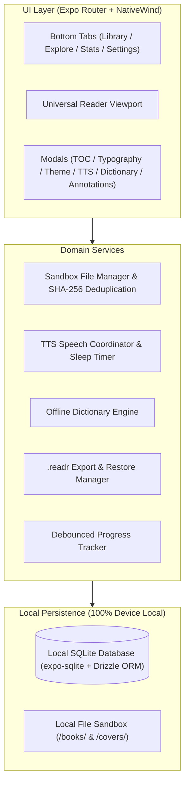

<div align="center">

# Readr

### A fast, 100% local, distraction-free mobile e-reader crafted for serious readers.

[](LICENSE)
[](https://expo.dev)
[](https://reactnative.dev)
[](https://www.typescriptlang.org/)
[](https://bun.sh)
[](tests/)
[](#contributing)

<br />

<p align="center">
  <a href="#key-features">Key Features</a> &bull;
  <a href="#the-monochromatic-sanctuary-design">Design System</a> &bull;
  <a href="#architecture">Architecture</a> &bull;
  <a href="#quick-start">Quick Start</a> &bull;
  <a href="#contributing">Contributing</a> &bull;
  <a href="#license">License</a>
</p>

</div>

## Overview

**Readr** is an open-source mobile reading sanctuary built with Expo SDK 57, React Native 0.86, and Drizzle ORM. Unlike commercial reading apps that trap readers in walled gardens or collect reading telemetry, Readr is **100% local**:

- **Zero Cloud Databases**: All reading history, bookmarks, highlights, and preferences live strictly on your device in SQLite.
- **Zero Mandatory Accounts**: No logins, no telemetry trackers, no remote analytics.
- **Universal Multi-Format Support**: Reads EPUB, PDF, plain text, and Markdown files.
- **2:3 Classic Book Proportions**: All book covers enforce classic 2:3 aspect ratios across grid and list views.
- **Monochromatic Aesthetic**: Calibrated grey, white, and black palettes with an independent color-temperature warmth overlay.

## Key Features

### Immersive Reading Engine
- **Universal Format Parser**: Native support for EPUB 2/3, PDF, Markdown, and TXT files.
- **The Fluid Folio Bar**: An unobtrusive bottom margin indicator displaying chapter title, mini-progress track, and velocity-calculated reading time estimates.
- **Dynamic Theming**: 4 calibrated palettes (**Crisp White**, **Parchment Grey**, **Charcoal Dusk**, and **OLED Pure Black**) paired with a color-temperature warmth overlay.
- **Granular Typography**: Custom controls for font family (*Literata*, *Atkinson Hyperlegible*, *Merriweather*, *JetBrains Mono*, *System*), font size stepper, line-height, text alignment, and margins.
- **Debounced Progress Persistence**: Reading location auto-saves every 500ms and flushes atomically to SQLite whenever the app is backgrounded.

### Highlights, Notes & Dictionary
- **Monochromatic Highlighting**: High-contrast, greyscale marker shades (Charcoal, Graphite, Silver, Platinum, Smoke).
- **Text-Anchored Notes**: Attach rich notes to any highlight and export them to clean Markdown.
- **Instant Offline Dictionary**: Long-press definition overlay complete with phonetics, parts of speech, usage examples, and audio pronunciation.

### Audio Narration (Text-to-Speech)
- **Background Read-Aloud**: Sentence-by-sentence text-to-speech engine powered by `expo-speech`.
- **Playback and Speed Controls**: 0.5x to 2.0x playback speed adjustments.
- **Configurable Sleep Timer**: 15, 30, 45, or 60-minute automatic shutoff timer.

### Reading Insights & Habit Tracking
- **16-Week Consistency Heatmap**: Monochromatic activity squares tracking daily reading frequency.
- **Streak & Velocity Metrics**: Track daily reading streaks, total minutes read, and completed books.
- **Customizable Daily Goals**: Set daily reading targets (time and pages) with milestone achievements.

### Portable Local Backup & Restore
- **Single-File Data Portability**: Export your entire library, annotations, and reading history into a portable `.readr` container archive.
- **Native OS Sharing**: AirDrop, save to files, or back up to your personal cloud drive without a server.
- **Full Restore Engine**: Merge `.readr` backups with automatic checksum validation and deduplication.

### Curated Open Catalogs
- **1-Tap Classic Downloads**: Instant access to curated public-domain masterpieces (*Pride and Prejudice*, *Meditations*, *The Great Gatsby*, *Frankenstein*, *Walden*) stored directly in your local sandbox.

## The Monochromatic Sanctuary Design

Readr follows strict design principles that prioritize long-form eye comfort and distraction-free immersion:

```
    CRISP WHITE                PARCHMENT GREY              CHARCOAL DUSK               OLED PURE BLACK
┌─────────────────┐        ┌─────────────────┐        ┌─────────────────┐        ┌─────────────────┐
│ Canvas: #FFFFFF │        │ Canvas: #F5F5F0 │        │ Canvas: #18181B │        │ Canvas: #000000 │
│ Text:   #18181B │        │ Text:   #262624 │        │ Text:   #FAFAFA │        │ Text:   #F4F4F5 │
│ Accent: #18181B │        │ Accent: #262624 │        │ Accent: #FAFAFA │        │ Accent: #FFFFFF │
└─────────────────┘        └─────────────────┘        └─────────────────┘        └─────────────────┘
```

- **True-Black OLED Mode**: Absolute `#000000` pitch background paired with muted `#F4F4F5` bone text to eliminate pixel halation and save battery.
- **Warmth Temperature Slider**: Independent color temperature filter overlay.
- **Tactile Micro-Interactions**: Subtle `expo-haptics` tactile pulses on page turns, filter chips, and bookmarking.

## Tech Stack & Architecture



| Layer | Technology | Version / Specification |
| :--- | :--- | :--- |
| **Framework** | Expo SDK | `~57.0.18` (React Native 0.86.3, React 19.2.3) |
| **Language** | TypeScript | `6.0.3` (Strict mode enabled) |
| **Package Manager** | Bun | `^1.3.x` |
| **Navigation** | Expo Router | `~57.0.17` (File-based typed routes) |
| **Styling** | NativeWind / Tailwind CSS | `v4.x` (Monochromatic design tokens) |
| **Database** | `expo-sqlite` + Drizzle ORM | SQLite WAL mode with relational schemas |
| **Filesystem** | `expo-file-system/legacy` | App-scoped sandbox (`/books/`, `/covers/`) |
| **Audio** | `expo-speech` | Platform-native speech synthesis |
| **Haptics** | `expo-haptics` | Native tactile feedback |
| **Iconography** | `lucide-react-native` | Minimalist vector icons |

## Project Structure

```
readr/
├── app/                      # Expo Router file-based routes
│   ├── (tabs)/               # Bottom tab navigator
│   │   ├── _layout.tsx       # Tab bar navigation shell
│   │   ├── library.tsx       # Local library grid & filter bar
│   │   ├── explore.tsx       # Public domain catalog & 1-tap downloader
│   │   ├── stats.tsx         # Reading streak heatmap & goal insights
│   │   └── settings.tsx      # Preferences & .readr backup manager
│   ├── reader/               # Fullscreen reading stack
│   │   └── [id].tsx          # Universal Reader container with sheets
│   ├── book/
│   │   └── [id].tsx          # Book details & session history
│   ├── collection/
│   │   └── [id].tsx          # Custom shelf collections view
│   ├── backup/
│   │   └── index.tsx         # .readr backup & restore wizard
│   └── _layout.tsx           # Root layout (Database init, ThemeProvider)
├── src/
│   ├── components/           # Reusable UI components
│   │   ├── common/           # ThemeProvider, Button, Sheet, Slider, Badge, SearchBar
│   │   ├── reader/           # FolioBar, ReaderToolbar, EpubReader, sheets
│   │   ├── library/          # BookCard (2:3 ratio), EmptyLibrary, FilterBar
│   │   └── stats/            # StreakHeatmap, StatCard, GoalProgressRing
│   ├── db/                   # Local database configuration
│   │   ├── schema/           # Drizzle ORM typed table definitions
│   │   ├── queries/          # Type-safe repository methods (books, settings, stats, collections)
│   │   └── client.ts         # expo-sqlite connection with WAL mode
│   ├── services/             # Core business logic
│   │   ├── storage/          # Sandbox file manager & sample book bootstrap
│   │   ├── reader/           # EPUB parser & debounced progress tracker
│   │   ├── tts/              # Text-to-Speech audio queue & sleep timer
│   │   ├── dictionary/       # Offline dictionary lookup engine
│   │   ├── backup/           # .readr portable archive export & restore
│   │   └── opds/             # Public domain OPDS catalog fetcher
│   ├── store/                # Zustand transient reader & library state
│   ├── utils/                # Theme tokens & date formatters
│   └── types/                # Shared domain TypeScript models
├── tests/                    # Unit test suites (Bun test runner)
├── assets/                   # App icons and graphics
└── package.json
```

## Quick Start

### Prerequisites
- [Bun](https://bun.sh) (v1.2+ recommended)
- Node.js (v18+)
- [Expo Go](https://expo.dev/go) or an iOS/Android simulator / Custom Dev Client

### 1. Clone and Install Dependencies
```bash
git clone https://github.com/hawkdotdev/readr.git
cd readr
bun install
```

### 2. Start the Development Server
```bash
bun run start
```

### 3. Launch on Target Platform
```bash
bun run ios        # Launch on iOS Simulator
bun run android    # Launch on Android Emulator
bun run web        # Launch in Browser Preview
```

### 4. Run Typecheck and Test Suites
```bash
bun run typecheck  # Run strict TypeScript compiler verification (0 errors)
bun test           # Run 15 automated unit test suites (100% pass)
```

## Contributing

Contributions are warmly welcomed. To contribute:

1. **Fork the repository**.
2. **Create a feature branch**: `git checkout -b feature/amazing-feature`.
3. **Commit your changes**: `git commit -m 'Add amazing feature'`.
4. **Verify tests and types**: Ensure `bun run typecheck` and `bun test` pass with 0 errors.
5. **Push to your branch**: `git push origin feature/amazing-feature`.
6. **Open a Pull Request**.

## License

Distributed under the **MIT License**. See [`LICENSE`](LICENSE) for more details.

<div align="center">
  Crafted with care by <b>HawkdotDev</b>.
</div>
