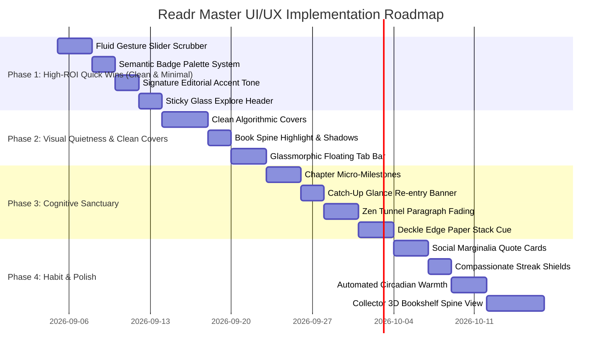

# Readr — Master UI/UX Design Audit & Enhancement Blueprint
*Psychological Principles, Color Theory, Ergonomics, Tactile Craft, and Radical Minimalism*

> *"Perfection is achieved, not when there is nothing more to add, but when there is nothing left to take away."*  
> — Antoine de Saint-Exupéry

---

## 1. Executive Summary & Design Vision

**Readr** is an offline-first, local-first mobile e-reader crafted for serious, immersive reading. While mainstream digital products engineer addictive interfaces that demand fragmented, high-frequency stimulation, a dedicated reading application is fundamentally an **intimate cognitive sanctuary**. Reading demands sustained attention, low visual friction, deep emotional resonance, and habitual reinforcement.

To achieve this, Readr combines **four rigorous scientific disciplines** with a foundational commitment to **radical minimalism and quiet restraint**:

```mermaid
graph TD
    A["Readr Design Foundation"] --> B["1. Cognitive Psychology & Behavioral Economics"]
    A --> C["2. Color Theory & Chromatic Ergonomics"]
    A --> D["3. Ergonomics & Motor Physics"]
    A --> E["4. Typography & Tactile Digital Craft"]
    A --> F["5. Radical Minimalism & Quiet Restraint"]
    
    B --> B1["Flow State & Frictionless Re-entry"]
    B --> B2["The Zeigarnik Effect & Chapter Milestones"]
    B --> B3["Fogg Model & Compassionate Streaks"]
    B --> B4["Dual-Coding & Generative Covers"]
    B --> B5["Zen Tunnel & Bio-Acoustic Flow"]
    
    C --> C1["Photopic vs. Scotopic Halation"]
    C --> C2["Purkinje Effect & Circadian Warmth"]
    C --> C3["Semantic Priming & Accent Identity"]
    C --> C4["Dyslexia-Optimized Color Spaces"]
    
    D --> D1["Fitts's Law & Fluid Scrubbing"]
    D --> D2["Glassmorphic Floating Chrome"]
    D --> D3["Thumb Reachability & 9-Zone Grid"]
    D --> D4["Kinetic Page Turn Physics & Haptics"]
    
    E --> E1["Editorial Typographic Triad"]
    E --> E2["Contact Shadow Physics & Spine Sheen"]
    E --> E3["Deckle Edge Spatial Progress Cues"]
    E --> E4["Collector's 3D Bookshelf Spine View"]
    E --> E5["Social Marginalia & Quote Cards"]
    
    F --> F1["The Single Hero Rule (One Focal Point)"]
    F --> F2["Border Elimination & Tonal Separation"]
    F --> F3["Clean Book Covers Without Badge Noise"]
    F --> F4["Progressive Disclosure for Deep Utilities"]
```



---

## 2. The 5 Anti-Clutter Design Rules for Readr

To ensure Readr remains pristine, uncluttered, and serene as its capabilities expand, all future UI enhancements must satisfy these **5 Anti-Clutter Guardrails**:

### Rule 1: The Single Hero Rule (One Focal Point per Screen)
Each screen must feature exactly **one** primary visual anchor:
* **Home**: The *Continue Reading* hero card. Everything else (Today's target, recent genres, metrics) flows downstream with generous vertical spacing.
* **Library**: The *Bookshelf*. Filter chips, search, and sort controls remain quiet, secondary utilities that never crowd out the book covers.
* **Explore**: The *Catalog Feed*. The server selector and search trigger must remain compact and unobtrusive.
* **Reader**: The *Text*. Zero UI chrome, zero floating buttons, zero edge indicators while reading. Chrome appears only upon intentional tap.

### Rule 2: The Border Elimination Rule (Tonal Separation over Grid Cages)
Excessive 1px hairline borders around cards, tiles, chips, and headers create visual "grid cage" fatigue.
* **Standard**: Prefer subtle tonal shifts between `colors.canvas` and `colors.surface`, combined with soft ambient drop shadows, rather than harsh 1px borders. Reserve borders strictly for interactive states or where contrast is insufficient.

### Rule 3: Clean Book Covers (Zero Badge Overload)
In cluttered reading apps, book thumbnails are polluted with multiple overlapping icons: heart icons, progress bars, percentage badges, file format tags, cloud download icons, and star ratings all competing for attention on a tiny 80x120px cover.
* **Readr Standard**: Keep book covers **pure artwork**. Display reading progress as a microscopic 2.5px baseline bar, and tuck format and status tags cleanly into the text metadata block beneath or beside the artwork.

### Rule 4: Progressive Disclosure (Tuck Away the Tools)
Deep utilities (OPDS server management, touch zone remapping, Bionic reading tuning, name replacements, dictionary, annotations) are deeply powerful, but should **never** clutter the primary reading or browsing experience.
* Keep settings and secondary tools organized inside focused modal sheets that slide up on demand and vanish completely when dismissed.

### Rule 5: Subtlety in Habit Gamification
Streaks and goals should provide quiet psychological reinforcement without feeling like a loud fitness tracker or social casino.
* Avoid full-screen celebratory modals, popups, or jarring confetti animations. Keep habit tracking minimal, elegant, and harmonious with the active theme.

### Anti-Patterns Explicitly Banned from Readr
- ❌ **No heavy skeuomorphic clutter** (e.g., fake wooden plank textures, artificial paper tears, glossy plastic buttons) that compete with book content.
- ❌ **No noisy social feeds, comments, or community widgets** on the Home tab. Readr is an intimate personal sanctuary.
- ❌ **No nested cards inside cards inside cards** with multiple layers of borders. Use clean vertical rhythm and negative space instead.

---

## 3. Architecture, Tab Taxonomy & Mental Models

### 3.1 Tab Taxonomy & Mental Model Inversion
* **The Cognitive Principle (Jakob's Law)**: Users spend the majority of their digital lives in other applications; their mental models are firmly rooted in established interface conventions. When terminology conflicts with user expectations, cognitive dissonance occurs.
* **The Historical Problem**: Historically, Readr suffered from an inverted tab taxonomy where the first tab was labeled **"Home"** (route: `library`), while the second tab was labeled **"Library"** (route: `explore`). A reader's mental model of a "Library" is their personal, physical bookshelf of owned and downloaded volumes. Presenting remote OPDS feeds under "Library" while personal files lived under "Home" caused chronic spatial disorientation.
* **The Resolution & Semantics**: Maintain a strict, unambiguous 5-tab separation:
  - **Tab 1: `Home` (`/home`)**: The **Active Reading Sanctuary & Momentum Dashboard**. Displays the user's immediate in-progress book, daily reading goals, personalized recommendations, and habit metrics.
  - **Tab 2: `Library` (`/library`)**: The **Personal Collection & Bookshelf**. Dedicated 100% to on-device books, local files, shelf organization, formats, tags, and bulk collection management.
  - **Tab 3: `Explore` (`/explore`)**: The **Discovery & External Catalog Hub**. Dedicated to remote OPDS servers (Standard Ebooks, Project Gutenberg, custom catalogs), public domain feeds, and feed searches.
  - **Tab 4: `Stats` (`/stats`)**: The **Habit & Analytics Log**. Deep lifetime analytics, recent session history, and 16-week consistency graphs.
  - **Tab 5: `Settings` (`/settings`)**: **Preferences, Gestures & Engine Overrides**.

---

### 3.2 Duplication & Confusion Between Home and Library Shelf
* **The Cognitive Principle (Hick's Law)**: Decision time increases logarithmically with the number and complexity of choices. When two parallel screens offer competing pathways to execute the same task, users experience cognitive hesitation.
* **The Architectural Rule**:
  - `home.tsx` must **never** duplicate full-collection management tools (such as bulk selection, format filters, file metadata editors, or shelf summary banners).
  - `home.tsx` focuses strictly on **resumption and habit formation** (Continue Reading hero card, horizontal carousel of started books, today's goal, and curated category spotlights).
  - `library.tsx` is the sole authority for **catalog manipulation** (grid/list toggling, sort dropdowns, format filtering, batch actions, and metadata modals).

---

### 3.3 Scrolling Architecture & Sticky Glass Header in Explore
* **The UI Problem**: In `explore.tsx`, the server hub (Standard Ebooks vs. Gutenberg vs. Custom OPDS), search input, and category selector were historically wrapped inside `ListHeaderComponent` within a single `FlatList`. Scrolling through remote catalogs caused all navigation and search controls to vanish off-screen.
* **The Resolution**: 
  - Pin the server hub, search bar, and category switcher into a **sticky, compact glassmorphic top header** (`BlurView`).
  - Dedicate the scrollable list container exclusively to book cards and catalog feeds so users never have to scroll 50 items back to the top just to switch servers or refine their search.

---

### 3.4 Offline Full-Text Search Architecture (FTS5 + Trigram Matching)
* **The Problem**: Library search currently relies on basic SQL `LIKE '%query%'` matching over title and author columns. This fails on slight typos, missing punctuation, or searches for memorable quotes inside book contents.
* **The Resolution**:
  - Introduce SQLite **FTS5 (Full-Text Search 5)** with trigram tokenization.
  - Index book titles, author names, user highlights, personal notes, and book descriptions into a virtual table.
  - Provide instant (sub-10ms) typo-tolerant results with highlighted matched snippet text (e.g. *"Matched in Chapter 3: '...it was the best of **times**, it was the...'"*).

---

## 4. Cognitive Psychology & Behavioral Design Insights

### 4.1 The Zeigarnik Effect & Chapter-Level Micro-Closure
* **The Psychological Principle**: Human working memory retains uncompleted tasks with subconscious tension, but facing a massive uncompleted endeavor (e.g., an 800-page volume showing `12% completed`) induces cognitive dread and avoidance.
* **The UI Application**:
  - Deconstruct macro-progress into bite-sized **micro-milestones**:
    > *"Chapter 7: 4 pages left (~5 mins)"*
  - On [ContinueReadingCard.tsx](file:///c:/Users/dwaip/OneDrive/Documents/Code/projects/readr/src/components/home/ContinueReadingCard.tsx) and [FolioBar.tsx](file:///c:/Users/dwaip/OneDrive/Documents/Code/projects/readr/src/components/reader/FolioBar.tsx), display estimated minutes remaining in the active chapter alongside total book progress.
  - Reaching chapter closure triggers a clean dopamine release, prompting the reader to think: *"I have time for just one more chapter."*

---

### 4.2 Frictionless Re-Entry: The "Catch-Up Glance"
* **The Psychological Principle**: The highest friction point in any reading habit is **starting**. When picking up a book after 24–72 hours of inactivity, reader working memory has decayed. Readers waste the first several minutes skimming previous pages to reconstruct context, often giving up and retreating to high-dopamine social apps.
* **The UI Application**:
  - Implement an unobtrusive **"Catch-Up Glance"** banner: When opening a book after >24 hours of inactivity, gently fade in an ambient 3-second capsule at the top of the reader:
    > *"Last read Tuesday · Highlighted: 'All cruelty springs from weakness.'"*
  - Tapping the banner instantly smooth-scrolls the reader to that anchor passage, immediately reviving narrative momentum.

---

### 4.3 The Fogg Behavior Model (B = MAP) & Streak Compassion
* **The Psychological Principle**: Lasting habits require Motivation, Ability, and a Prompt. Traditional gamified streak counters rely on punitive mechanics: missing a single day resets the counter to zero, inducing shame and driving up to 60% of users to abandon the app completely (*the "what-the-hell" effect*).
* **The UI Application**:
  - **Compassionate Streak Shields (Grace Days)**: Automatically award 1 grace shield for every 14 consecutive days of meeting reading targets (storing up to 2 shields). If a day is missed, a shield is consumed automatically:
    > *"Rest day shield activated! Your 24-day streak is preserved. Ready for your next chapter?"*
  - **Micro-Habit Recovery Prompts**: If the user has logged 0 minutes by 9:00 PM, display a low-barrier prompt on Home:
    > *"Read just 2 minutes tonight to keep your momentum alive."*
    Lowering the ability threshold overcomes startup inertia and consistently leads to 15+ minutes of reading.

---

### 4.4 Dual-Coding Theory & Algorithmic Generative Editorial Covers
* **The Psychological Principle**: Information is retained and recognized significantly faster when encoded through both verbal propositions and visual imagery. Readers rarely recall books by database strings; they recall cover palettes, geometric silhouettes, and typography.
* **The UI Problem**: Books imported without embedded cover art (common in TXT, FB2, MOBI, and older EPUBs) currently display a generic gray placeholder box with a `BookOpen` icon, making personal libraries look broken and uncurated.
* **The UI Resolution**:
  - Implement an **Algorithmic Generative Cover Engine**:
    1. Deterministically hash `book.title + book.author` into an integer seed.
    2. Map the seed to one of 8 curated, classic bookcloth palettes (antique oatmeal, deep sage, oxblood, Prussian navy, slate charcoal, plum).
    3. Render an embossed double-rule border with subtle drop shadow.
    4. Typeset the title using classic editorial typography (`FONTS.mona.bold` or serif display) with generous tracking and centered alignment.
    5. Place the author name at the bottom in spaced uppercase lettering.
  - *Result*: Every imported document or public domain classic instantly gains a collectible, high-end editorial presence.

---

### 4.5 Focus Mode: The "Zen Tunnel" (Progressive Peripheral Fading)
* **The Psychological Principle**: Visual clutter in the periphery triggers involuntary micro-saccades (rapid involuntary eye movements), pulling cognitive focus away from the active reading sentence. Readers with ADHD, fatigue, or dyslexia suffer elevated cognitive load.
* **The UI Application**:
  - Introduce an optional **"Zen Tunnel"** toggle in the reader's Focus Tab:
  - While scrolling or turning pages, the active paragraph remains at **100% luminance and full opacity**, while preceding and succeeding paragraphs gently fade to **40% opacity**.
  - Creates a tunnel of cognitive calm that guides the eye effortlessly down the page, eliminating accidental line-skipping and regression.

---

### 4.6 Bio-Acoustic Flow: Ambient Reading Soundscapes
* **The Psychological Principle**: Audio environments shape brainwave states. Moderate ambient white noise (around 50-60 dB) enhances cognitive performance and creative flow by masking erratic background auditory distractions.
* **The UI Application**:
  - Integrate a built-in offline ambient soundscape generator into `TypographySheet > FocusTab`:
    - **Rain on Windowpane** (calming, low-frequency masking).
    - **Library Hearth** (soft rhythmic crackle).
    - **Subtle Café Murmur** (beneficial ambient chatter).
    - **40Hz Gamma Focus Tone** (scientifically linked to sustained attention and memory consolidation).
  - Subtle volume slider with automated sleep timer matching the user's reading target.

---

### 4.7 Visceral Metaphor: Reading Pace Decay & "Dust Motes"
* **The Psychological Principle**: Physical books left untouched on a shelf gather a faint layer of dust—a gentle, poignant physical reminder of unfinished journeys.
* **The UI Application**:
  - When a book remains in "reading" status but has not been opened for >60 days:
  - Render a delicate, artistic visual cue on its card: a tiny spiderweb icon or faint dust texture, alongside a whimsical subtitle:
    > *"Waiting patiently on Chapter 12 for 64 days."*
  - Tapping it triggers an encouraging re-entry prompt: *"Dust off this adventure?"*

---

## 5. Color Theory & Chromatic Ergonomics

### 5.1 Contrast Inversion & The Von Restorff Effect (Accent Isolation)
* **The Principle (The Isolation Effect)**: When multiple similar objects are present, the one that differs from the rest in luminance or hue is most likely to be noticed and remembered.
* **The Current Flaw**: In `src/utils/theme.ts`, the default `light` theme sets `accent: '#1A1918'` (identical to `textPrimary`). In `sepia`, `accent: '#262421'`. In `dark`, `accent: '#FAFAFA'`.
  - *Visual Consequence*: Primary calls-to-action (Import Book, Read Now, Download, Active Filters, Save) share the exact same chromatic value as body text. They blend into the background and fail to communicate affordance.
* **The Chromatic Solution**:
  - Decouple `accent` from monochrome ink across all palettes. Introduce an authentic editorial accent palette:
    - **Terracotta / Burnt Amber** (`#C2410C` light / `#FB923C` dark): Evokes traditional bookcloth, library leather bindings, and fine press typography.
    - **Botanical Emerald** (`#059669` light / `#34D399` dark): Natural, circadian-friendly reading focus.
    - **Oxford Azure** (`#1D4ED8` light / `#60A5FA` dark): Classic intellectual clarity.

---

### 5.2 Photopic vs. Scotopic Vision & Halation in Dark Mode
* **The Optical Physics**: In dark environments, human pupils dilate to capture scarce light. Displaying pure white text (`#FFFFFF`) against pitch black (`#000000`) creates optical **irradiation / halation**—light bleeding across retinal cell boundaries. This causes fuzzy letter edges and severe ocular fatigue, particularly for readers with mild astigmatism.
* **Ergonomic Guidelines**:
  - **Standard Charcoal Dark**: Pair `#121214` canvas with `#E4E4E7` text (softened off-white with an ideal ~14:1 contrast ratio, exceeding WCAG AAA without retinal vibration).
  - **OLED Pure Black**: Reserve true `#000000` solely for the `oled` theme to achieve maximum diode power-down, but soften body text to `#D4D4D8` (85% luminance) rather than stark `#FFFFFF`.
  - **Warm Sepia / Parchment Equilibrium**: Maintain a minimum 7:1 contrast ratio against yellowed ground (`#FAF6EE`) to guarantee sunlight readability without glare.

---

### 5.3 The Purkinje Effect & Circadian Ambient Shifting
* **The Circadian Biology**: Retinal ganglion cells containing melanopsin are acutely sensitive to short-wavelength blue light (~460–480nm), which directly suppresses melatonin secretion and delays REM sleep. As ambient light dims, retinal rods take over (the *Purkinje effect*), shifting peak sensitivity toward green-blue spectrums.
* **The Implementation**:
  - **Automated Sun-Synched Warmth**: Eliminate the need for manual slider adjustments in settings.
  - Calculate local dusk and dawn based on device timezone.
  - Smoothly scale `warmthLevel` from 0% at 7:00 PM to 45% (2200K amber equivalent) by 10:30 PM using a 30-minute cubic bezier curve.
  - Transition between themes with a 300ms cross-fade (`[0.2, 0.0, 0.0, 1.0]`) to eliminate visual flashbangs.

---

### 5.4 Semantic Color Priming & Badge Hierarchy
* **The Current Flaw**: In [Badge.tsx](file:///c:/Users/dwaip/OneDrive/Documents/Code/projects/readr/src/components/common/Badge.tsx), badges for `accent`, `success`, and `warning` all resolve to identical `#E4E4E7` / `#27272A` grays.
* **The Chromatic Standardization**:

| Badge Variant | Light Theme Ground / Text | Dark Theme Ground / Text | Emotional & Cognitive Prime |
|---|---|---|---|
| **Format (EPUB/PDF/CBZ)** | `#F1EFEA` / `#57534E` | `#27272A` / `#A1A1AA` | Neutral technical metadata |
| **Status: In-Progress** | `#EFF6FF` / `#1D4ED8` | `#1E293B` / `#60A5FA` | Active cognitive focus |
| **Status: Completed** | `#ECFDF5` / `#047857` | `#064E3B` / `#34D399` | Achievement & satisfaction |
| **Favorite / Heart** | `#FFF1F2` / `#E11D48` | `#4C0519` / `#FB7185` | Personal emotional affinity |
| **Category / Tag** | `${theme.accent}14` / `${theme.accent}` | `${theme.accent}24` / `${theme.accent}` | Contextual discovery |
| **Warning / Notice** | `#FEF3C7` / `#B45309` | `#451A03` / `#FBBF24` | Cautionary affordance |

---

### 5.5 High-Legibility & Dyslexia-Optimized Color Spaces
* **The Principle**: Dyslexic readers and individuals with visual stress (Meares-Irlen syndrome) often experience text "swimming", distortion, or glaring river patterns when reading black text on high-luminance white paper.
* **The UI Application**:
  - Add a dedicated **"Chamomile & Slate"** reading palette:
    - Background: `#FFFDE7` (soft warm chamomile cream).
    - Text: `#2C3437` (deep slate graphite with 82% luminance).
    - Reduced glare, maximum letter contour definition, zero optical vibrations.

---

## 6. Ergonomics, Gestures & Motor Control

### 6.1 The Stepper Masquerading as a Slider
* **The Motor Problem (Fitts's Law)**: In [Slider.tsx](file:///c:/Users/dwaip/OneDrive/Documents/Code/projects/readr/src/components/common/Slider.tsx), the progress track is a passive, non-interactive `View`. Users are forced to tap small `[ - ]` and `[ + ]` buttons at the track extremities to change values. Adjusting a reading goal from 15 to 60 minutes requires 45 individual thumb strikes.
* **The Ergonomic Resolution**:
  - Transform `Slider.tsx` into a **true fluid scrub controller**:
    1. Attach a gesture handler / `PanResponder` to the track that continuously maps touch X coordinates to values.
    2. Fire light haptic ticks (`Haptics.selectionAsync`) as values cross step boundaries.
    3. Retain the stepper buttons at the extremities for fine single-unit increments.
    4. Provide immediate interactive feedback with an expanding thumb indicator during drag gestures.
  - *Minimalist Advantage*: Delivers faster, more tactile control without adding a single extra pixel of visual clutter to the screen.

---

### 6.2 Glassmorphic Floating Chrome & Backdrop Blur
* **The Current Flaw**: `CustomFloatingTabBar` and `ReaderBottomCapsule` float over content with solid, opaque backgrounds and hard borders. When scrolling content beneath them, text abruptly cuts off against the opaque capsule boundary.
* **The Resolution**:
  - Integrate `BlurView` from `expo-blur` (`tint="systemThinMaterial"` or adaptive dark/light acrylic blur).
  - Apply an ultra-fine border (`borderColor: colors.border`, `borderWidth: StyleSheet.hairlineWidth`).
  - Add an animated sliding indicator pill behind the active tab using React Native Reanimated spring physics (`damping: 18, stiffness: 220`), giving tab transitions an organic, fluid feel.

---

### 6.3 Thumb Reachability & 9-Zone Reader Touch Grid
* **The Ergonomic Rule**: In mobile reading, one-handed operation is predominant (commutes, bed, walking). Crucial navigation zones must align with natural thumb arcs.
* **The 9-Zone Mapping**:
  - Keep primary forward navigation ("Next Page") assigned to the entire right column and bottom-center zone (covering 70% of reachable thumb space).
  - Assign "Previous Page" to the narrow left margin.
  - Reserve the dead center zone exclusively for toggling reader chrome, preventing accidental page flips when intending to open menu sheets.

---

### 6.4 Kinetic Page-Turning Physics (Skew-X Inertial Curl)
* **The Ergonomic Defect**: In many digital readers, turning a page feels like an instantaneous slide or hard cut. Real paper has mechanical resistance, weight, and elasticity.
* **The UI Application**:
  - Implement a velocity-sensitive interactive page turn:
  - During finger drag, apply a dynamic 3D skew transform (`transform: [{ perspective: 1000 }, { rotateY: ... }, { skewX: ... }]`).
  - As the finger releases, the page snaps over with a natural spring bounce (`damping: 16, stiffness: 180`).
  - A subtle trailing shadow under the turning leaf darkens proportionally to the angle of elevation.

---

### 6.5 Multi-Tier Haptic Spatial Hierarchy
* **The Tactile Feedback Principle**: Flat touchscreens lack mechanical key switches. Well-engineered haptics bridge the gap between digital pixels and physical matter without visual clutter.
* **The Haptic Palette**:
  - **Light Tick (`Haptics.selectionAsync`)**: Fired on slider scrub steps, active tab changes, and letter-by-letter touch zone remapping.
  - **Feather Spring (`ImpactFeedbackStyle.Light`)**: Fired on standard page turns and bookmark toggles.
  - **Subtle Double Thud (`ImpactFeedbackStyle.Medium`)**: Fired when crossing chapter boundaries, providing spatial confirmation that a new chapter has begun without checking the folio bar.
  - **Celebration Chord (`NotificationFeedbackType.Success`)**: Fired when completing the final page of a book or hitting a 30-day streak milestone.

---

## 7. Typography, Spatial Hierarchy & Tactile Digital Craft

### 7.1 The Editorial Typographic Triad
Readr features a sophisticated typography suite:
* **Mona Sans**: Industrial, high-legibility UI sans.
* **Hubot Sans**: Geometric, bold display sans for numbers and hero headlines.
* **Mona Sans Mono**: Monospace typography for dates, file metadata, and technical tags.

**Typographical Rules of Craftsmanship**:
1. **Tabular Figures for Dynamic Metrics**: Apply `fontVariant: ['tabular-nums']` across all timers, counters, speedometers, and progress percentages to eliminate horizontal text jitter as digits change.
2. **Optimal Reading Comfort Grid**:
   - Optimal line length for sustained comprehension is **55–75 characters per line (CPL)**.
   - Enforce vertical leading: `lineHeight = fontSize * 1.55`.
   - Calculate horizontal reading margins dynamically relative to screen width to prevent line lengths from exceeding the physiological comfort threshold.

---

### 7.2 Skeuomorphic Tactility: Spine Highlight & Contact Shadows
* **The Sensory Metaphor**: Flat 2D rectangles with 1px borders feel disconnected from the tactile warmth of physical paper.
* **The Craft Enhancements**:
  - **Spine Gradient Sheen**: Overlay a 2.5px semi-transparent vertical gradient down the left edge of book covers:
    `linear-gradient(to right, rgba(255,255,255,0.25), rgba(0,0,0,0.15) 80%, transparent)`
    This creates the subtle optical illusion of a bound, curved book spine.
  - **Dual Contact Shadow Physics**:
    - *Layer 1 (Contact)*: Tight, dark shadow (`offset: {x: 0, y: 2}`, `opacity: 0.14`, `radius: 3`).
    - *Layer 2 (Atmospheric)*: Soft ambient drop (`offset: {x: 0, y: 8}`, `opacity: 0.08`, `radius: 16`).

---

### 7.3 Deckle Edge Physical Progress Cue
* **The Metaphor**: In a physical book, the reader always possesses a peripheral, tactile awareness of how many pages remain under their right thumb versus how many have been turned under their left thumb.
* **The UI Application**:
  - Along the right margin of `EpubReader` and `ModernEpubReader`, render a microscopic simulated paper deckle stack:
  - As reading progress advances from 0% to 100%, the visual density of the paper edge smoothly shifts from the right margin to the left margin.
  - Readers instinctively perceive their progress through spatial intuition without needing to consult numeric progress bars.

---

### 7.4 The Collector's 3D Bookshelf (Spine View Mode)
* **The Visual Metaphor**: Real book lovers take pride in their physical bookcases. Seeing vibrant cloth spines standing shoulder-to-shoulder with gold foil lettering brings profound emotional delight.
* **The UI Application**:
  - Introduce a **3rd View Mode in `LibraryScreen`**:
  - Renders a realistic horizontal oak/walnut bookshelf where books stand as vertical spines.
  - Spine width correlates with page count (thick for 900-page tomes, slim for novellas).
  - Vertical embossed typography rotated 90 degrees with metallic foil sheen.
  - Tap a spine to gently pull it out from the shelf with a smooth 15px vertical slide and open it.

---

### 7.5 Social Marginalia: Editorial Quotation Cards
* **The Social Principle**: Readers love sharing quotes, but taking a raw screenshot of text looks sloppy and exposes private reader chrome.
* **The UI Application**:
  - In [QuickHighlightMenu.tsx](file:///c:/Users/dwaip/OneDrive/Documents/Code/projects/readr/src/components/reader/QuickHighlightMenu.tsx), add a **"Share Quote"** button:
  - Automatically compiles the highlighted text into a stunning, high-res graphic card:
    - Large quotation marks in classic serif typography.
    - Curated paper texture background (Cream Parchment or Night Charcoal).
    - Book cover thumbnail, title, author, and chapter timestamp at the bottom.
    - 1-tap export to Instagram Stories, Twitter/X, or system photo gallery.

---

### 7.6 In-Line Contextual Smart Glossary (Scaffolding Classic Literature)
* **The Cognitive Principle**: Encountering archaic, rare, or philosophical terminology (e.g. *ataraxia*, *perspicacity*, *apotheosis*) pulls readers out of immersion if they have to navigate away to a full dictionary app.
* **The UI Application**:
  - When enabled in `ExperienceTab`, subtle dotted underlines appear under challenging literary terms.
  - Tapping the word pops a lightweight 1-line contextual gloss directly above the word, vanishing upon the next tap. No full-screen modals; zero disruption of reading flow.

---

## 8. Analytics, Habit Loops & Behavioral Reinforcement

### 8.1 Circadian "Time to Read" Smart Reminders
* **The Behavioral Principle**: Habits are triggered by consistent environmental cues and circadian timing.
* **The UI Application**:
  - Readr logs the timestamp distribution of reading sessions.
  - If a reader consistently reads at 10:15 PM before sleep, schedule a quiet, elegant push reminder at 10:00 PM:
    > *"Your nightly reading sanctuary awaits. Chapter 4 has 7 minutes remaining."*

---

### 8.2 Real-Time WPM Pace Synchronizer
* **The Dynamic Math**: Static reading speed estimates (e.g. fixed 250 WPM) are inaccurate because reading speed varies between complex philosophy and light fiction.
* **The UI Application**:
  - Calculate a rolling **Session WPM** over the last 10 minutes of active reading.
  - Dynamically recompute "Minutes Left in Chapter" on [FolioBar.tsx](file:///c:/Users/dwaip/OneDrive/Documents/Code/projects/readr/src/components/reader/FolioBar.tsx) to match the reader's actual current velocity.

---

### 8.3 The "Year in Books" Interactive Infographic
* **The Retention Loop**: End-of-year summaries (like Spotify Wrapped) generate enormous emotional affinity and user pride.
* **The UI Application**:
  - Under `StatsScreen`, introduce an annual review generator:
    - Total words consumed (with relatable comparisons: *"You read 850,000 words this year — equivalent to the entire Lord of the Rings trilogy!"*).
    - Peak reading hour heat clock.
    - Most beloved genres and longest sustained reading streaks.
    - Downloadable, beautiful multi-slide story cards ready for sharing.

---

## 9. Retrospective: Enhancements Already Executed in the Codebase

For engineering clarity and historical tracking, the following major design evolutions have been completed:

```markdown
- [x] Corrected 5-Tab Architecture: Home, Library, Explore, Stats, Settings.
- [x] Restructured ContinueReadingCard: Progress info placed above bar, action button placed below bar.
- [x] Redesigned GenresSection: Editorial spotlight card (cover on left, details on right) + 3 list books underneath, synchronized with category switcher tabs.
- [x] Overhauled Today's Target Card: Eliminated jarring, full-bleed inverted black block; unified with theme surfaces, bold display typography, and minimal stats footer.
- [x] Consolidated Reading Habit Header: Renamed heatmap to "Metrics" and removed redundant "LIFETIME METRICS" text label.
- [x] Modularized Sub-Components: Decoupled monolithic screens into clean domain directories (`home/`, `library/`, `explore/`, `stats/`, `settings/`).
```

---

## 10. Master Implementation Roadmap & Priority Matrix



### Top 10 High-Impact Initiatives Ranked by Effort/Reward

| Rank | Initiative | Target File(s) | Minimalist & Cognitive Benefit |
|:---:|---|---|---|
| **1** | **Fluid Drag Scrubber for Sliders** | [Slider.tsx](file:///c:/Users/dwaip/OneDrive/Documents/Code/projects/readr/src/components/common/Slider.tsx) | Tactile scrub control without adding extra buttons or visual noise. |
| **2** | **Signature Editorial Accent Tone** | [theme.ts](file:///c:/Users/dwaip/OneDrive/Documents/Code/projects/readr/src/utils/theme.ts) | Subtle, intentional color affordance that replaces flat monochrome ink without neon distraction. |
| **3** | **Semantic Badge Color System** | [Badge.tsx](file:///c:/Users/dwaip/OneDrive/Documents/Code/projects/readr/src/components/common/Badge.tsx) | Chromatically distinguishes formats (EPUB/PDF) & reading status at a glance. |
| **4** | **Sticky Glass Header in Explore** | [explore.tsx](file:///c:/Users/dwaip/OneDrive/Documents/Code/projects/readr/app/(tabs)/explore.tsx) | Keeps OPDS hub & search input permanently accessible during deep scrolling. |
| **5** | **Clean Algorithmic Book Covers** | [BookCard.tsx](file:///c:/Users/dwaip/OneDrive/Documents/Code/projects/readr/src/components/library/BookCard.tsx) | Clean Swiss typography replaces ugly, generic placeholder gray boxes. |
| **6** | **Chapter Micro-Milestones** | [ContinueReadingCard.tsx](file:///c:/Users/dwaip/OneDrive/Documents/Code/projects/readr/src/components/home/ContinueReadingCard.tsx) | Lowers reading intimidation by showing time remaining in current chapter on a single text line. |
| **7** | **"Catch-Up Glance" Re-Entry Capsule** | [ReaderToolbar.tsx](file:///c:/Users/dwaip/OneDrive/Documents/Code/projects/readr/src/components/reader/ReaderToolbar.tsx) | Eliminates re-reading friction when resuming books after >24 hours with an auto-dismissing banner. |
| **8** | **Glassmorphic Floating Tab Bar** | [app/(tabs)/_layout.tsx](file:///c:/Users/dwaip/OneDrive/Documents/Code/projects/readr/app/(tabs)/_layout.tsx) | Adds subtle backdrop blur and animated spring pill transitions between tabs. |
| **9** | **Social Marginalia Quote Cards** | [QuickHighlightMenu.tsx](file:///c:/Users/dwaip/OneDrive/Documents/Code/projects/readr/src/components/reader/QuickHighlightMenu.tsx) | 1-tap generation of beautiful, shareable typographic quote cards. |
| **10** | **The Collector's 3D Bookshelf Spine View**| [LibraryScreen.tsx](file:///c:/Users/dwaip/OneDrive/Documents/Code/projects/readr/app/(tabs)/library.tsx) | Delivers the nostalgic tactile joy of viewing vertical book spines on oak shelves. |
