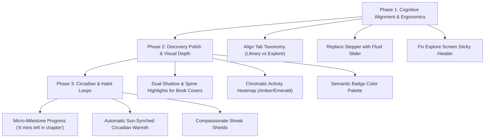

# Readr — UI/UX Design Audit & Enhancement Recommendations
*Psychological Principles, Color Theory, Ergonomics, and Craftsmanship*

---

## 1. Executive Summary & Design Philosophy

Readr is a privacy-first, local-first reading application equipped with a robust reader engine, rich typography options, and deep reading utilities. However, a reading application is not merely a tool for viewing text; it is an **intimate cognitive environment**. Reading requires sustained attention, low visual friction, emotional resonance, and habitual reinforcement.

This document analyzes Readr's user interface through four fundamental disciplines:
1. **Cognitive Psychology & Behavioral Economics**: Managing cognitive load, habit loops, and the preservation of flow state.
2. **Color Theory & Chromatic Ergonomics**: Contrast sensitivity, circadian physiology, halation reduction, and visual hierarchy.
3. **Typography & Spatial Hierarchy**: Vertical rhythm, tracking physics, and the interplay between editorial and utilitarian typefaces.
4. **Tactile Digital Craft**: Dimensional depth, physical metaphors, and multisensory feedback (haptics, physics-based motion).

---

## 2. Identified UI & Architecture Problems

### 2.1 Tab Taxonomy & Mental Model Inversion
* **Current State**: The first tab is labeled **"Home"** (route: `library`), while the second tab is labeled **"Library"** (route: `explore`).
* **Psychological Friction (Mental Model Mismatch)**: A user's mental model of a "Library" is their personal repository of owned/saved books. In Readr, tapping "Library" displays a remote catalog/OPDS discovery feed, while their actual personal collection lives under "Home".
* **Impact**: Violates Jakob’s Law (users spend most of their time on other apps and expect yours to follow conventions). Users experience repeated disorientation when looking for their imported books.
* **Resolution**: Realign tab routes and semantics:
  - Tab 1: **"Library"** (or "Home" as a personalized reading dashboard).
  - Tab 2: **"Explore"** / **"Discover"** (for OPDS feeds, catalog recommendations, and external sources).

---

### 2.2 Duplication & Confusion Between Home and Explore Shelf
* **Current State**: Both `library.tsx` and the "Shelf" sub-tab in `explore.tsx` render the user's on-device books with different filter chips, different context menus, and separate state machines.
* **Psychological Friction (Hick's Law & Redundancy)**: Users face two parallel pathways to perform the same task (managing local books), increasing cognitive load and decision latency.
* **Resolution**: 
  - `library.tsx` should serve as the **Active Reading Sanctuary & Dashboard** (Hero in-progress book, "Books you started" carousel, quick jump back into reading).
  - `explore.tsx` should cleanly separate **Discovery** (Popular picks, Recommended feeds, OPDS catalogs) from **Catalog Management** without duplicating full-page shelf layouts.

---

### 2.3 Original Explore Sections Context & Scrolling Architecture
* **Current State**: The original `explore.tsx` contains rich discovery sections:
  1. **"Popular"** (top public domain picks not yet on device, with download indicators).
  2. **"Recommended"** (curated recommendations tailored to reader taste).
  3. **Custom Server Catalogs** (Standard Ebooks, Project Gutenberg, custom OPDS).
* **UI Friction**: The entire top header, search bar, mode selector, and feed pills are wrapped inside `ListHeaderComponent` in a single `FlatList`. When the user scrolls down through the catalog, all search and navigation controls vanish off-screen.
* **Resolution**: Pin the navigation bar, search input, and feed pills into a fixed top header with backdrop blur/subtle elevation. Keep the scrollable list container dedicated strictly to the book carousels and catalog grid.

---

### 2.4 The Stepper Masquerading as a Slider
* **Current State**: [Slider.tsx](file:///c:/Users/dwaip/OneDrive/Documents/Code/projects/readr/src/components/common/Slider.tsx) displays a progress track flanked by `[ - ]` and `[ + ]` buttons. The track cannot be scrubbed or dragged; it only responds to discrete clicks.
* **Fitts's Law & Motor Ergonomics**: Adjusting reading goals from 10 minutes to 60 minutes requires 50 separate button taps (at step=1) or 10 taps (at step=5). Fine-tuning typography values (font scaling, line spacing) feels slow and robotic.
* **Resolution**: Transform `Slider.tsx` into a true fluid scrub controller with pan gestures, keeping the stepper buttons as auxiliary fine-tuning increments.

---

### 2.5 Contrast Inversion & Monochromatic Accents
* **Current State**: In the default `light` and `dark` themes, `accent` is identical to `textPrimary` (`#1A1918` in light, `#FAFAFA` in dark).
* **Visual Isolation Failure (Von Restorff Effect)**: Important interactive calls-to-action (Import Book, Download, Active Filter, Save) share the exact same luminance and hue as standard body text. They fail to draw the eye or communicate affordance.
* **Resolution**: Introduce a dedicated, refined accent tone (e.g., editorial burnt amber `#D97706` or rich indigo `#6366F1`) that elevates interactive elements without creating visual noise.

---

### 2.6 Grayscale Activity Heatmap
* **Current State**: [StreakHeatmap.tsx](file:///c:/Users/dwaip/OneDrive/Documents/Code/projects/readr/src/components/stats/StreakHeatmap.tsx) represents reading activity in light mode using four muted shades of gray (`#E4E4E7` to `#64748B`).
* **Visual Differentiation & Dopamine Loop Failure**: On mobile displays outdoors or at low brightness, these gray steps blend together. Gray psychologically connotes inactivity, neutrality, or disabled states rather than momentum.
* **Resolution**: Use a chromatic vibrancy scale (e.g., warm amber-gold or botanical emerald) where color saturation and luminance scale in tandem with reading minutes.

---

## 3. Cognitive Psychology & Behavioral Design Insights

### 3.1 The Zeigarnik Effect & Chapter-Level Closure
* **Principle**: Humans remember and obsess over uncompleted tasks far more than completed ones. However, facing a 900-page book can induce dread rather than motivation.
* **UI Application**:
  - Instead of solely displaying global progress (`14% completed`), introduce **micro-milestones**:
    > *"4 pages left in Chapter 8 (~6 mins)"*
  - Place a subtle, elegant chapter progress bar in the bottom capsule or folio bar. Breaking reading into bite-sized cognitive goals encourages "just one more chapter" behavior.

---

### 3.2 Frictionless Re-Entry & State Preservation
* **Principle**: The highest friction point in any reading habit is **starting**. If resuming a book requires navigation through menus, load states, or mental re-orientation, the reader easily diverts to high-dopamine social apps.
* **UI Application**:
  - The `ContinueReadingCard` on Home should feature a prominent, high-affordance **"Resume Chapter X"** button with dynamic time-to-finish estimations.
  - Implement a **"Catch-Up Glance"**: When opening a book after >24 hours of inactivity, display the last highlighted sentence or paragraph in a gentle fade-in overlay to immediately re-anchor the reader's working memory.

---

### 3.3 The Fogg Behavior Model (B = MAP) & Streak Compassion
* **Principle**: Behavior requires Motivation, Ability, and a Prompt. Traditional streak mechanisms in productivity apps trigger shame and abandonment when a streak is lost.
* **UI Application**:
  - **Streak Shields / Grace Days**: Allow 1 automatic rest day per 14-day streak cycle.
  - **Micro-Habit Prompts**: If the user hasn't met their 30-minute daily goal by 9:00 PM, offer a low-barrier prompt: *"Read 2 minutes tonight to keep your momentum alive."*

---

### 3.4 Dual-Coding Theory (Visual & Semantic Association)
* **Principle**: Information is retained best when encoded through both visual imagery and verbal propositions.
* **UI Application**:
  - Readers rarely recall books by exact database title; they remember cover artwork colors, typography, or spatial shelf placement.
  - Books with missing cover art currently show a generic placeholder icon. Replace this with an **algorithmic generative cover system**: use the book title's hash to generate beautiful editorial duotone covers with classic typography (Baskerville/Caslon styling) so every book has a distinct, memorable visual identity.

---

## 4. Color Theory & Chromatic Ergonomics

### 4.1 Photopic vs. Scotopic Vision & Halation in Dark Mode
* **The Physics**: In low light, the human pupil dilates. Pure white text (`#FFFFFF`) placed on absolute black (`#000000`) creates optical **irradiation / halation** (light bleeding over retinal boundaries), causing blurry edges and severe ocular fatigue, especially for readers with slight astigmatism.
* **Recommendations**:
  - **Dark Mode Surface Pairing**: Keep true `#000000` solely for OLED battery preservation, but tint text to a softened `#E4E4E7` or `#D4D4D8` (90% luminance).
  - **Atmospheric Charcoal (Standard Dark)**: Use `#121214` canvas with `#F4F4F5` text, providing a smooth contrast ratio of ~14:1 (exceeding WCAG AAA without optical vibration).
  - **Warm Sepia / Parchment Equilibrium**: The current `parchment` palette (`#F5ECD7`) is excellent; ensure text contrast maintains at least 7:1 against the yellowed ground to preserve readability in sunlight.

---

### 4.2 The Purkinje Effect & Circadian Ambient Shifting
* **The Biology**: As ambient light dims, retinal rods become active, shifting spectral sensitivity toward blue-green wavelengths while short-wavelength blue light directly suppresses melatonin secretion.
* **Recommendations**:
  - **Dynamic Circadian Shift**: Rather than requiring manual activation of the "Night Amber Overlay", provide an optional **"Sun-Synched Tint"** that gently increases color temperature warmth (2200K equivalent) between sunset and sunrise based on device time.
  - **Theme Inversion Smoothness**: Transition between color palettes using a 300ms cubic bezier cross-fade (`[0.2, 0.0, 0.0, 1.0]`) to prevent jarring visual flashbangs when switching modes.

---

### 4.3 Semantic Color Priming & Badge Hierarchy
* **Current Issue**: As noted in the audit, `Badge.tsx` maps `accent`, `success`, and `warning` to identical gray values.
* **Chromatic Standardization**:
  | Badge Type | Light Theme (Background / Text) | Dark Theme (Background / Text) | Emotional Prime |
  |---|---|---|---|
  | **Format (EPUB/PDF)** | `#F1EFEA` / `#7A766D` | `#27272A` / `#A1A1AA` | Neutral Metadata |
  | **In-Progress** | `#EFF6FF` / `#2563EB` | `#1E293B` / `#60A5FA` | Active Focus |
  | **Completed** | `#ECFDF5` / `#059669` | `#064E3B` / `#34D399` | Achievement & Satisfaction |
  | **Favorite** | `#FFF1F2` / `#E11D48` | `#4C0519` / `#FB7185` | Emotional Attachment |
  | **Popular Rank** | `#FEF3C7` / `#B45309` | `#451A03` / `#FBBF24` | Social Proof & Discovery |

---

## 5. Typography & Spatial Craftsmanship

### 5.1 The Editorial Typographic Triad
Readr already utilizes a sophisticated font bundle:
- **Mona Sans**: Industrial, high-legibility UI sans.
- **Hubot Sans**: Geometric, impactful display sans.
- **Mona Sans Mono**: Technical, monospace metadata font.

**Refinement Strategy**:
1. **Numbers & Stats**: Ensure `fontVariant: ['tabular-nums']` is applied across all page counters, timers, and reading speed indicators so changing numbers don't cause layout jitter.
2. **Reading View Typography**:
   - Optimal line length for sustained reading is **55–75 characters per line (CPL)**.
   - Set default reader horizontal margins dynamically according to screen width to keep line lengths inside the physiological reading comfort zone.
   - Enforce an optimal vertical grid: `lineHeight = fontSize * 1.55`.

---

### 5.2 Physicality & Elevation in Digital Spaces
* **The Problem**: Overly flat 2D cards with simple 1px hairline borders feel sterile and detached from the physical joy of reading.
* **Tactile Improvements**:
  - **Contact Shadow Physics**: Give book covers a dual-layer shadow:
    - Layer 1: Tight, darker contact shadow (`offset: {x: 0, y: 2}`, `opacity: 0.12`, `radius: 3`).
    - Layer 2: Diffuse atmospheric ambient drop (`offset: {x: 0, y: 8}`, `opacity: 0.08`, `radius: 16`).
  - **The Book Spine Highlight**: Add a vertical 1.5px subtle gradient sheen down the left edge of cover images (`rgba(255, 255, 255, 0.2)` transitioning to `rgba(0, 0, 0, 0.15)`) to replicate a physical bound book spine.
  - **Deckle Edge Progress Cue**: In the reader, render a microscopic stack of paper lines along the right margin whose visible density shifts from right to left as pages turn, giving readers intuitive tactile awareness of their depth in the book.

---

## 6. Actionable Implementation Roadmap

### Top 5 Immediate Quick-Wins (Highest ROI)
1. **Rename Tabs in `_layout.tsx`**: Align user expectations immediately by giving the Discovery/OPDS tab its rightful title and preserving the user's personal books as "Library".
2. **Fix `Badge.tsx` Colors**: Give success, warning, and rank badges distinct chromatic identities instead of shared monochrome gray.
3. **Upgrade `StreakHeatmap.tsx` to Chromatic Green/Amber**: Transform the flat gray boxes into a rewarding visual habit graph.
4. **Pin Explore Screen Header**: Make the catalog and shelf search/filter controls persistent while browsing long feeds.
5. **Draggable Slider Scrubbing**: Upgrade `Slider.tsx` with fluid pan gestures for effortless typography and goal adjustments.
