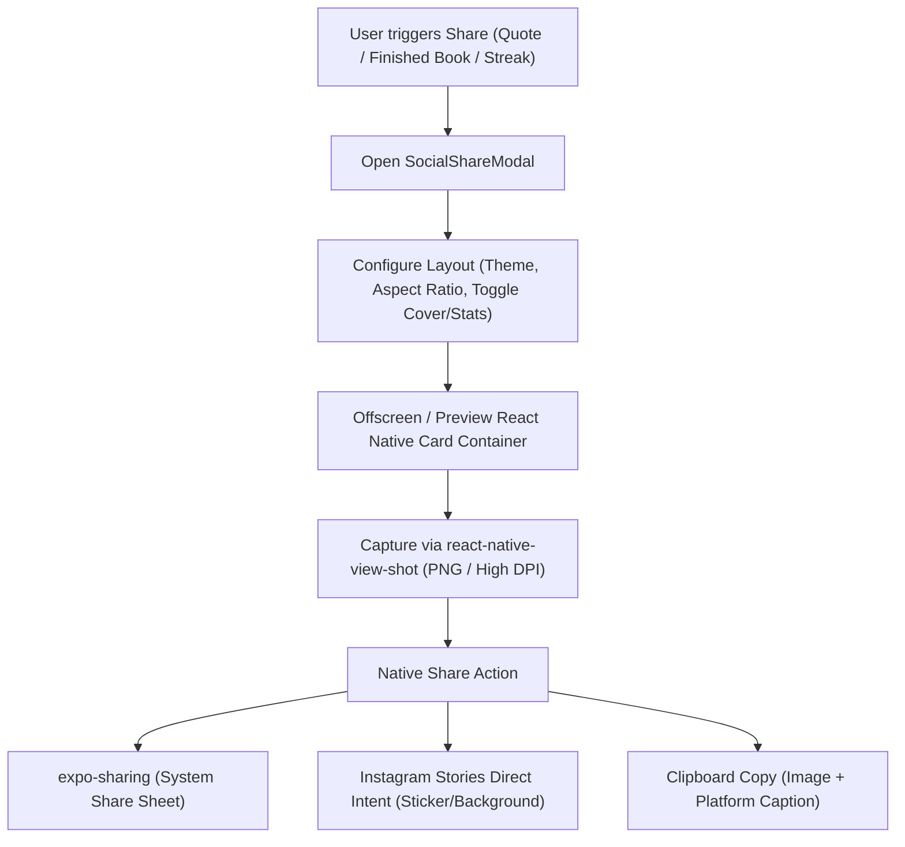

# Ideation: Automated Social Media Post Generation & Sharing System for Readr

**Document Version:** 1.0.0  
**Project:** Readr (Expo / React Native / TypeScript)  
**Status:** Ideation & Architecture Proposal  

---

## 1. Executive Summary & Feasibility

> **Is it possible?**  
> **Yes, 100%.** Modern mobile reading apps (e.g., Readwise, Apple Books, Fable, Literal) rely heavily on visual social sharing to drive retention, aesthetic self-expression, and organic viral growth. 

In Readr’s Expo / React Native stack, we can build a **zero-friction Social Share Engine** that automatically compiles reading passages, completed book celebrations, and streak milestones into:
1. **High-Resolution Visual Cards** formatted precisely for Instagram Stories, Threads, Twitter/X, and WhatsApp.
2. **Platform-Optimized Captions & Hashtags** generated on-the-fly.
3. **Direct Social App Hand-Off** via native share sheets, Instagram Story Stickers, and web intents.

---

## 2. Core Sharing Scenarios (Content Triggers)

| Scenario | Trigger | What Gets Generated | Target Platforms |
| :--- | :--- | :--- | :--- |
| **Passage & Quote Card** | Selecting text in Reader $\to$ tapping *"Social Card"* | Typographic quote card with bookcloth border, author attribution, and book title | Instagram Stories (9:16), Threads/X (1:1) |
| **Book Finished Celebration** | Marking book as *"Finished"* in Reader or Library | "Finished Book" badge, rating, total reading time, favorite highlight, and completion date | Instagram Stories, Twitter/X, LinkedIn |
| **Reading Streak & Heatmap** | Tapping streak flame on Home or Stats tab | Fire badge, streak days, weekly reading heatmap, and total minutes read | Instagram Stories (9:16), WhatsApp Status |
| **"Currently Reading" Shelfie** | Radial menu $\to$ *"Share Progress"* | 3D book cover, chapter progress, and estimated time to finish | Threads, Bluesky, Twitter/X |
| **Monthly Reading Wrapped** | End-of-month recap in Stats tab | Carousel of books completed, pages read, reading speed, and top quotes | Instagram Story multi-slide carousel |

---

## 3. Visual Aesthetics & Themes

Readr's radical minimalism and editorial elegance should extend directly into social exports. Users will be able to toggle between signature themes:

### Theme Presets
1. **Editorial Paper (Default)**
   - Cream / warm linen background (`#FAF7F2`)
   - High-contrast serif typography (*Newsreader* / *Playfair*)
   - Embossed double-rule framing, generous white space, and large decorative curly quotation marks (`“`).
2. **Obsidian Darkroom**
   - Deep OLED black (`#0B0D12`)
   - Muted slate borders, warm amber insignia accent (`#D97706`), crisp mono captioning (*JetBrains Mono*).
3. **Heritage Clothbound**
   - Uses the book's procedural generative cover palette (e.g. *Florentine Gold*, *Tuscan Terracotta*, *Prussian Blue*).
   - Classic cloth texture, blind-debossed corner flourishes, and center crest insignia.
4. **Bento Card Minimal**
   - Clean modern grid: Book Cover on top-left, Star Rating on top-right, Quote/Stat in large centered cards, and discreet `Read on Readr` pill footer.

---

## 4. Multi-Platform Aspect Ratios & Templates

```
┌─────────────────┐   ┌─────────────────┐   ┌─────────────────────────┐
│                 │   │                 │   │                         │
│  9:16 (Story)   │   │   1:1 (Feed)    │   │      16:9 (Banner)      │
│  1080 x 1920    │   │   1080 x 1080   │   │      1200 x 675         │
│                 │   │                 │   │                         │
│  Instagram      │   │  Threads, Feed  │   │  Twitter/X, LinkedIn    │
│  TikTok, Status │   │  Bluesky        │   │                         │
│                 │   └─────────────────┘   └─────────────────────────┘
└─────────────────┘
```

- **Stories (9:16 / 1080×1920)**: Fullscreen vertical layout with ample safe zones at top (for Instagram handle) and bottom (for reply bars).
- **Square (1:1 / 1080×1080)**: Balanced typography centered for Instagram post, Threads, and Bluesky.
- **Horizontal (16:9 / 1200×675)**: Landscape layout optimized for Twitter/X inline feed previews without cropping.

---

## 5. Smart Auto-Copywriting Engine

When sharing, the system copies or prepopulates an aesthetic text caption matching the platform:

### Sample Auto-Generated Captions:
- **Quote Share:**
  ```text
  "The only people for me are the mad ones, the ones who are mad to live, mad to talk..."
  
  — On the Road, Jack Kerouac
  🔖 Finished Chapter 4 via @ReadrApp
  #BookTwitter #CurrentlyReading #Kerouac
  ```
- **Book Finished Share:**
  ```text
  Just finished reading "Letters from a Stoic" by Seneca 🏛️
  
  ⏱️ 6 hrs 24 mins • ⭐⭐⭐⭐⭐ (5/5)
  "We suffer more often in imagination than in reality."
  
  Tracked on Readr. #BookTok #Stoicism #ReadingCommunity
  ```

---

## 6. Technical Architecture & Implementation Blueprint



### Key Libraries:
- **`react-native-view-shot`**: High-fidelity bitmap rasterizer that captures any React Native component hierarchy into a high-res PNG file.
- **`expo-sharing`**: Opens the native iOS/Android share sheet with the generated image file, allowing users to send directly to Instagram, WhatsApp, Twitter, Telegram, AirDrop, or save to Camera Roll.
- **`expo-clipboard`**: Copies image and markdown/plain-text captions directly into the clipboard.
- **`Linking`**: Direct deeplinks into social apps:
  - Instagram Stories: `instagram-stories://share` with background PNG
  - Twitter / X Intent: `https://twitter.com/intent/tweet?text=...`
  - Threads Intent: `https://threads.net/intent/post?text=...`
  - WhatsApp Intent: `whatsapp://send?text=...`

---

## 7. Interactive UI & Customization Features

Inside the **`SocialShareModal`**, the user gets full creative agency:

1. **Aspect Ratio Switcher**:
   - `9:16 Story` | `1:1 Square` | `16:9 Landscape`
2. **Style Palette Swatches**:
   - `Paper` | `Obsidian` | `Bookcloth` | `Minimal`
3. **Element Toggles**:
   - `[x] Book Cover`
   - `[x] Author & Title`
   - `[x] Star Rating`
   - `[x] Reading Stats (Page / Time)`
   - `[ ] Readr Watermark` (User can disable for clean aesthetics)
4. **One-Tap Actions**:
   - 📸 **Share Image to Story / Feed**
   - 📋 **Copy Image & Caption**
   - 💾 **Save to Photos**

---

## 8. Phased Implementation Roadmap

### Phase 1: Foundation (Quote & Passage Cards)
- Install and configure `react-native-view-shot` and `expo-sharing`.
- Upgrade existing `QuoteCardModal.tsx` into a full-featured `SocialShareModal.tsx` with PNG rendering.
- Add 9:16 and 1:1 format toggles and theme selector (Paper, Obsidian, Bookcloth).

### Phase 2: Milestone & Book Finished Cards
- Trigger `SocialShareModal` upon marking a book as *"Finished"* in the Reader or Library.
- Auto-populate book cover, reading time, completion date, and star rating.
- Implement smart hashtag and caption generator.

### Phase 3: Streaks, Heatmaps & Deep Linking
- Add "Share Streak" button to Reading Streak flame and Stats screen.
- Export weekly reading heatmaps.
- Implement app deep links or book titles embedded as compact QR codes or clean footer typography.
