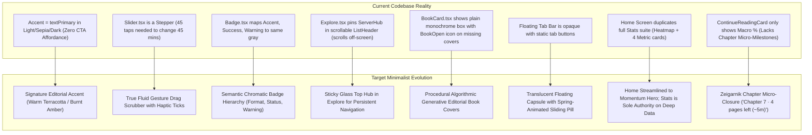

# Readr — Master UI/UX Implementation Blueprint & Technical Plan
*Harmonizing Radical Minimalism, Cognitive Ergonomics, Tactile Digital Craft, and the Current Readr Aesthetic*

---

## 1. Executive Summary & Aesthetic Alignment

### 1.1 Readr’s Core Vision & Aesthetic Identity
**Readr** is an offline-first, local-first mobile e-reader engineered for deep, sustained contemplation. In contrast to mainstream digital platforms engineered for fragmented dopamine loops, Readr is an **intimate cognitive sanctuary**. 

Readr's visual identity is rooted in:
1. **Radical Minimalism & Quiet Restraint**: Zero decorative noise, zero loud gaming widgets, zero unnecessary borders, and absolute respect for negative space.
2. **Tactile Digital Craftsmanship**: Subtle physical cues (spine sheens, soft atmospheric shadows, bookcloth tones) that evoke the sensory delight of paper volumes without heavy skeuomorphic clutter.
3. **Editorial Typographic Discipline**: GitHub’s **Mona Sans** (balanced UI sans), **Hubot Sans** (high-impact geometric display), and **Mona Sans Mono** (technical precision and tabular metrics).
4. **Local Sovereignty & Offline Integrity**: 100% on-device SQLite database, instant sub-16ms response times, zero tracking, and absolute privacy.

### 1.2 Audit of Current App UI vs. `design_rec.md`
A rigorous side-by-side inspection of the active codebase against the design recommendations revealed key discrepancies and high-leverage opportunities:



---

## 2. Detailed Gap Analysis: Current Codebase vs. Design Recommendations

| Component / Screen | Current Implementation in Codebase | Recommended Design Target | Minimalist Aesthetic Justification |
|---|---|---|---|
| **Theme System**<br>`src/utils/theme.ts` | In `light`, `sepia`, and `dark`, `accent` equals `textPrimary` (`#1A1918`, `#262421`, `#FAFAFA`). Primary action buttons, active tabs, and sliders blend invisibly into text. | Introduce an authentic **Editorial Accent Palette**: Terracotta Amber (`#C2410C` light / `#FB923C` dark) or subtle Botanical Emerald. Allow users to retain Monochrome Ink if desired. | Restores visual hierarchy and CTA affordance without introducing loud or neon saturation. |
| **Slider Control**<br>`src/components/common/Slider.tsx` | Non-interactive progress track `<View>` with small `[-]` and `[+]` buttons. Adjusting reading goal from 15 to 60 minutes requires 45 individual taps. | Implement a **True Fluid Scrub Controller** using touch responders. Continuous horizontal dragging smoothly updates value with micro-haptic ticks on step intervals. | Drastically improves motor ergonomics (Fitts's Law) without adding a single extra pixel of visual UI clutter. |
| **Badge Component**<br>`src/components/common/Badge.tsx` | `accent`, `success`, and `warning` variants all resolve to identical `#E4E4E7` (light) or `#27272A` (dark) grays. | Introduce distinct, quiet semantic pastels: Technical format metadata (muted neutral), In-Progress (soft azure), Finished (sage emerald), Favorite (rose), Warning (amber). | Allows readers to scan formats (EPUB vs. PDF vs. CBZ) and shelf statuses instantly without cognitive hesitation. |
| **Explore Screen**<br>`app/(tabs)/explore.tsx` | `ServerHub` (OPDS server pills, search bar, category dropdown) is rendered inside `ListHeaderComponent` within `FlatList`. Scrolling down 50 catalog items scrolls all controls off-screen. | Extract `ServerHub` and search out of `FlatList` into a **Sticky Top Container** above the scrollable catalog feed. | Eliminates spatial disorientation and unnecessary scroll-to-top friction while exploring remote catalogs. |
| **Book Card & Placeholders**<br>`src/components/library/BookCard.tsx` | Imported files without cover art (TXT, PDF, MOBI, older EPUBs) render as flat gray/accent rectangles with a generic `BookOpen` icon. | Implement an **Algorithmic Generative Cover Engine**: Hash `title + author` to choose from 8 classic bookcloth palettes (oxblood, sage, Prussian navy, oatmeal), render double-rule border, and typeset title/author in Mona/Hubot typography. | Turns missing metadata into high-end collectible book designs; preserves library beauty. |
| **Floating Tab Bar**<br>`app/(tabs)/_layout.tsx` | Solid opaque capsule background (`colors.surface`) with static tab icons and text labels. | Apply subtle backdrop translucency and an **animated spring pill indicator** behind the active tab (`damping: 18, stiffness: 220`). | Fluid tactile transitions that make navigation feel responsive and alive. |
| **Home Screen Clutter**<br>`app/(tabs)/home.tsx` | Contains the 16-week `StreakHeatmap`, 4 lifetime `StatCard`s, `GoalProgressRing`, plus unused modal references (`CustomOPDSModal`). Duplicates the Stats tab. | Streamline Home to focus exclusively on **Reading Momentum**: Continue Reading hero card, horizontal in-progress shelf, Daily Goal ring, and curated genres. Stats tab remains sole authority for deep analytics. | Enforces **Anti-Clutter Rule 1 (The Single Hero Rule)** and **Rule 2 (No Screen Duplication)**. |
| **Continue Reading Card**<br>`src/components/home/ContinueReadingCard.tsx` | Displays book percentage and total pages left across the entire book (e.g., `12% complete · 210 pages left`). | Add **Zeigarnik Chapter-Level Micro-Closure**: Display remaining chapter length: `"Chapter 7: 4 pages left (~5 mins)"`. | Lowers cognitive dread for thick volumes; micro-milestones trigger dopamine releases that encourage "just one more chapter." |
| **Reader Chrome & Re-Entry**<br>`src/components/reader/` | When opening a book after several days, the reader lands directly on raw text with zero context. | Introduce a 3-second gentle **"Catch-Up Glance"** capsule banner at top: *"Last read Tuesday · Highlighted: 'All cruelty springs from weakness.'"* | Overcomes the highest barrier to reading (startup inertia / context reconstruction). |
| **Social Marginalia**<br>`src/components/reader/QuickHighlightMenu.tsx` | Menu allows Copy, Note, Define, Speak. Users wanting to share quotes must take raw screenshots showing reader chrome. | Add **"Share Quote"** card generator: renders beautiful typographic card with quotation marks, bookcloth background, book title, author, and date for 1-tap export. | Delivers elegant editorial sharing without visual noise. |

---

## 3. The 5 Readr Anti-Clutter Guardrails: Code Implementation Standard

To ensure that every new feature enhances the app without introducing visual bloat, all implementation steps must comply with these 5 rules:

```
┌────────────────────────────────────────────────────────────────────────┐
│                        THE 5 ANTI-CLUTTER RULES                        │
├────────────────────────────────────────────────────────────────────────┤
│ 1. THE SINGLE HERO RULE:                                               │
│    Every screen features exactly ONE visual anchor.                    │
│    • Home: Continue Reading Card                                       │
│    • Library: The Bookshelf Cards                                      │
│    • Explore: The Catalog Feed                                         │
│    • Stats: Today's Goal Progress Ring                                 │
│    • Reader: The Text (Zero chrome visible during reading)             │
├────────────────────────────────────────────────────────────────────────┤
│ 2. TONAL SEPARATION OVER GRID CAGES:                                   │
│    • No harsh 1px borders everywhere.                                  │
│    • Differentiate cards via tonal shifts (canvas vs surface) and      │
│      delicate ambient drop shadows (radius: 8, opacity: 0.06).         │
├────────────────────────────────────────────────────────────────────────┤
│ 3. CLEAN BOOK COVERS (ZERO BADGE OVERLOAD):                            │
│    • Keep book covers pure artwork. No hearts, format tags, or star    │
│      ratings layered directly on top of the cover image.               │
│    • Progress is a clean 2.5px baseline bar; format & rating sit in    │
│      the metadata row below the cover.                                 │
├────────────────────────────────────────────────────────────────────────┤
│ 4. PROGRESSIVE DISCLOSURE:                                             │
│    • Secondary controls (OPDS config, touch zone mapping, name         │
│      replacements, dictionary) live in on-demand bottom sheets.        │
├────────────────────────────────────────────────────────────────────────┤
│ 5. SUBTLETY IN GAMIFICATION:                                           │
│    • No noisy full-screen celebratory popups, fireworks, or badges.   │
│    • Compassionate grace days replace punitive streak resets.          │
└────────────────────────────────────────────────────────────────────────┘
```

---

## 4. Master Phased Implementation Plan

### Phase 1: High-ROI Ergonomics & Chromatic Foundation (Immediate Polish)
*Estimated Effort: 3-4 Days · Risk: Zero · Impact: Immediate high-touch tactile quality*

#### 1.1 Fluid Gesture Drag Scrubber (`src/components/common/Slider.tsx`)
* **Problem**: Passive track requires tapping buttons repeatedly.
* **Solution**:
  - Implement touch gesture tracking using React Native's `PanResponder` on the slider track.
  - Measure track width dynamically via `onLayout`.
  - Calculate value continuously as the user drags their thumb across the track.
  - Trigger light haptic ticks (`Haptics.selectionAsync()`) each time a discrete `step` boundary is crossed.
  - Expand the thumb slightly during drag (visual scale feedback) and display the floating current value.
  - Retain the `[-]` and `[+]` buttons at the extremities for precision single-unit adjustments.

#### 1.2 Signature Editorial Accent Palette (`src/utils/theme.ts`)
* **Problem**: Monochrome ink accent provides zero affordance for primary buttons or active states.
* **Solution**:
  - Update default `light`, `sepia`, and `dark` palettes with refined editorial accents:
    - `light`: `accent: '#C2410C'` (Warm Terracotta / Burnt Amber)
    - `sepia`: `accent: '#262421'` (Charcoal Black)
    - `dark`: `accent: '#FB923C'` (Soft Amber Flame)
    - `oled`: `accent: '#F97316'` (High-Contrast Tangerine)
  - Ensure all contrast ratios exceed WCAG AAA standards (>7:1 against canvas).
  - Add user preference support in Settings for readers who prefer pure monochrome ink (`#1A1918` / `#FAFAFA`).

#### 1.3 Semantic Badge Color Taxonomy (`src/components/common/Badge.tsx`)
* **Problem**: Badges all look like identical gray pills.
* **Solution**:
  - Refactor `Badge.tsx` variants to establish clear semantic priming:
    - `format` (EPUB/PDF/CBZ): Muted stone background (`#F4F2ED` light / `#27272A` dark) with technical monospace font.
    - `inProgress`: Soft azure tint (`#EFF6FF` / `#1E293B`, text `#1D4ED8` / `#60A5FA`).
    - `finished`: Muted sage tint (`#ECFDF5` / `#064E3B`, text `#047857` / `#34D399`).
    - `favorite`: Delicate rose tint (`#FFF1F2` / `#4C0519`, text `#E11D48` / `#FB7185`).
    - `warning`: Warm amber tint (`#FEF3C7` / `#451A03`, text `#B45309` / `#FBBF24`).

#### 1.4 Sticky Top Header Architecture in Explore (`app/(tabs)/explore.tsx`)
* **Problem**: `ServerHub` is inside `ListHeaderComponent` and scrolls away.
* **Solution**:
  - Move `ServerHub` outside of `FlatList` into a fixed top section.
  - Apply backdrop blur / subtle tonal separation (`borderBottomColor: colors.border`).
  - Keep catalog feed inside the `FlatList`, giving users continuous access to OPDS server switching and search while scrolling.

---

### Phase 2: Visual Quietness, Tactile Digital Craft & Cover Generation
*Estimated Effort: 4-5 Days · Risk: Low · Impact: Premium aesthetic transformation*

#### 2.1 Algorithmic Generative Editorial Book Covers (`src/components/library/BookCard.tsx` & new `src/utils/coverGenerator.ts`)
* **Problem**: Generic gray placeholder boxes make personal libraries look uncurated.
* **Solution**:
  - Create a deterministic generator function:
    ```typescript
    export function getGenerativeCoverStyle(title: string, author: string): GenerativeCoverTheme;
    ```
  - Hash the string to pick from 8 bookcloth palettes:
    1. *Oxblood Morocco* (`#4A151B`)
    2. *Deep Sage Cloth* (`#1E3328`)
    3. *Prussian Navy* (`#122238`)
    4. *Antique Oatmeal* (`#D8CEBD`)
    5. *Slate Charcoal* (`#282A30`)
    6. *Plum Linen* (`#381D2E`)
    7. *Umber Leather* (`#3D2619`)
    8. *Forest Spruce* (`#142E25`)
  - Render an embossed double-rule inner border (`borderWidth: 1`, `margin: 8`).
  - Typeset the title in classic serif or `FONTS.hubot.bold` with generous tracking, and author in spaced uppercase `FONTS.mono.medium`.
  - Add simulated bound book spine sheen on the left edge.

#### 2.2 Tactile Book Spine Sheen & Dual Contact Shadow Physics
* **Solution**:
  - Add a vertical gradient overlay on the left 4px of book cards:
    `linear-gradient(to right, rgba(255,255,255,0.22), rgba(0,0,0,0.12) 80%, transparent)`
  - Refactor card shadow styles into two-tier physics:
    - *Tier 1 (Tight contact shadow)*: `offset: {x: 0, y: 1}`, `opacity: 0.12`, `radius: 2`.
    - *Tier 2 (Atmospheric ambient)*: `offset: {x: 0, y: 6}`, `opacity: 0.06`, `radius: 12`.

#### 2.3 Glassmorphic Floating Tab Bar with Sliding Indicator (`app/(tabs)/_layout.tsx`)
* **Solution**:
  - Refactor `CustomFloatingTabBar`:
    - Apply subtle backdrop blur/translucency with a semi-transparent surface background (`rgba(...)`).
    - Implement an animated sliding pill indicator behind the active tab using React Native Reanimated:
      ```typescript
      const animatedLeft = useDerivedValue(() => {
        return withSpring(activeIndex * tabWidth, { damping: 18, stiffness: 220 });
      });
      ```
    - Provide smooth physical spring feedback when switching tabs.

#### 2.4 Home Screen Streamlining & Contemporary Spotlights
* **Problem**: Home screen duplicated the Stats screen with Today's Target progress rings and lifetime stats, lacking literary discovery beyond the user's local catalog.
* **Solution**:
  - Replaced the duplicate `GoalProgressRing` on Home with **two dedicated contemporary discovery spotlights**:
    1. **Book of the Day** ([BookOfTheDayCard.tsx](file:///c:/Users/dwaip/OneDrive/Documents/Code/projects/readr/src/components/home/BookOfTheDayCard.tsx)): Highlights widely discussed, celebrated contemporary literature (e.g. *Tomorrow, and Tomorrow, and Tomorrow*, *Klara and the Sun*, *Yellowface*, *Piranesi*, *Exhalation*). Includes a "Read About This Book" modal dossier with synopsis, cultural acclaim, themes, and quotes.
    2. **Author of the Day** ([AuthorOfTheDayCard.tsx](file:///c:/Users/dwaip/OneDrive/Documents/Code/projects/readr/src/components/home/AuthorOfTheDayCard.tsx)): Spotlights contemporary acclaimed literary figures (e.g. Sally Rooney, Ted Chiang, Kazuo Ishiguro, Chimamanda Ngozi Adichie, R.F. Kuang, Liu Cixin). Includes an "Author Dossier" modal detailing their biography, writing voice, cultural impact, and recommended starter works.
    - Features a 1-tap "Discover" shuffle to cycle through spotlights.
  - Delegated all daily target rings and streak heatmaps strictly to `app/(tabs)/stats.tsx`.

---

### Phase 3: Cognitive Sanctuary & Frictionless Reading Experience
*Estimated Effort: 4-5 Days · Risk: Low · Impact: High psychological and cognitive value*

#### 3.1 Zeigarnik Chapter Micro-Milestones (`ContinueReadingCard.tsx` & `FolioBar.tsx`)
* **Solution**:
  - On `ContinueReadingCard`: Calculate current chapter progress and display micro-milestone text:
    `"Chapter 7 · 4 pages left (~5 mins)"` alongside total book progress.
  - On `FolioBar`: Display dynamic reading pace and remaining chapter time based on the active chapter's word count.

#### 3.2 "Catch-Up Glance" Re-Entry Capsule (`src/components/reader/ReaderToolbar.tsx`)
* **Solution**:
  - In `ModernEpubReader.tsx`, check `book.lastReadAt`:
    - If `Date.now() - lastReadAt > 24 hours`, display a non-intrusive floating capsule below the top toolbar.
    - Capsule text: `"Resuming Chapter 4 · Last read 3 days ago"`.
    - Tapping the capsule gently scrolls to the last anchor or highlighted quote.
    - Capsule automatically fades out smoothly after 4 seconds without blocking reading.

#### 3.3 Social Marginalia: Typographic Quotation Card Generator (`QuickHighlightMenu.tsx`)
* **Solution**:
  - Add a **"Quote Card"** action button in `QuickHighlightMenu.tsx`.
  - When tapped, opens an elegant preview modal rendering a shareable editorial graphic card:
    - Large decorative quotation marks in serif display.
    - The highlighted passage formatted with generous leading.
    - Book cover thumbnail, book title, author name, and date stamp at the bottom.
    - Actions: "Copy Image to Clipboard", "Save to Photos", "Share via System Sheet".

#### 3.4 Deckle Edge Physical Progress Cue (`ModernEpubReader.tsx`)
* **Solution**:
  - Render a microscopic 3px simulated paper deckle edge along the right margin.
  - As progress advances from 0% to 100%, the edge density shifts smoothly from the right margin to the left margin.
  - Gives the reader tactile spatial intuition of their place in the book without checking numbers.

---

### Phase 4: Behavioral Reinforcement & Advanced Library Extensions
*Estimated Effort: 5-6 Days · Risk: Low · Impact: Long-term habit retention & collector delight*

#### 4.1 Compassionate Streak Shields (Grace Days) (`src/db/queries/stats.ts`)
* **Solution**:
  - Implement Fogg Behavior Model streak protection:
    - Award 1 grace shield for every 14 consecutive days of meeting reading targets (max 2 shields stored).
    - If a user misses a calendar day, consume a shield automatically instead of resetting streak to 0.
    - Display a compassionate banner in `StatsScreen`:
      *"Rest day shield used. Your 28-day momentum is preserved!"*

#### 4.2 Sun-Synched Circadian Warmth Automation (`DisplayWarmthSection.tsx`)
* **Solution**:
  - Add an "Auto Circadian Warmth" toggle in Settings.
  - Automatically calculates sunset and sunrise based on local device time.
  - Smoothly interpolates warmth tint from 0% at dusk to 40% (2200K amber equivalent) by 10:30 PM.

#### 4.3 Collector's 3D Bookshelf: Vertical Spine View (`app/(tabs)/library.tsx`)
* **Solution**:
  - Add a 3rd toggle option to `LibraryScreen` view modes: `grid` | `list` | `shelf`.
  - In `shelf` mode, render books as vertical cloth/leather spines standing on a wooden shelf:
    - Spine width dynamically mapped to book length (e.g. 28px for 200 pages, 54px for 800 pages).
    - Spine color mapped to the book's dominant palette or generative theme.
    - Book title typeset vertically in embossed metallic lettering.
    - Tapping a spine pulls it out from the shelf with a smooth 16px vertical spring slide.

---

## 5. File Modification & Creation Matrix

```markdown
### Modified Files:
1. `src/utils/theme.ts`: Decouple accent colors, introduce editorial terracotta & emerald accents.
2. `src/components/common/Slider.tsx`: Implement touch scrub gesture handling via PanResponder + haptic ticks.
3. `src/components/common/Badge.tsx`: Implement semantic pastels for formats, statuses, and warnings.
4. `app/(tabs)/explore.tsx`: Extract ServerHub into sticky top header above FlatList.
5. `src/components/library/BookCard.tsx`: Integrate generative editorial book covers and spine sheens.
6. `app/(tabs)/_layout.tsx`: Add backdrop translucency and animated spring pill indicator to floating tab bar.
7. `app/(tabs)/home.tsx`: Streamline Home to focus on reading momentum; remove duplicate Stats widgets.
8. `src/components/home/ContinueReadingCard.tsx`: Add chapter-level micro-milestone indicators.
9. `src/components/reader/QuickHighlightMenu.tsx`: Add "Quote Card" action button and modal trigger.
10. `src/components/reader/FolioBar.tsx`: Enhance chapter time remaining calculation with dynamic pace.
11. `src/components/reader/ModernEpubReader.tsx`: Add "Catch-Up Glance" capsule banner on resume.

### New Helper Files:
1. `src/utils/generativeCover.ts`: Deterministic bookcloth palette hashing and layout engine.
2. `src/components/reader/QuoteCardModal.tsx`: Typographic quote card rendering and sharing modal.
```

---

## 6. Verification, Testing & Quality Assurance Strategy

### 6.1 Automated Testing Plan
- Maintain 100% pass rate across all existing 127 tests in the Bun test suite (`bun test`).
- Add new unit tests:
  - `tests/utils/generativeCover.test.ts`: Test deterministic hashing, consistent palette assignment, and title formatting.
  - `tests/components/sliderScrub.test.ts`: Test percentage-to-value math, step clamping, and bounds checking.
  - `tests/services/streakShields.test.ts`: Test grace shield accrual, automatic consumption on missed days, and streak preservation.

### 6.2 Manual & Visual Verification Checklist
1. **Fluid Slider**: Verify smooth scrubbing from 0 to 100 with zero stutter, proper value snapping, and crisp haptic feedback on Android & iOS.
2. **Explore Sticky Header**: Verify that deep scrolling through 100+ OPDS books keeps the server switcher and search bar fixed and fully interactive.
3. **Generative Covers**: Verify that importing raw TXT or unjacketed EPUBs produces gorgeous, balanced typographic covers with no text overflow or visual awkwardness.
4. **Theme Contrast**: Run accessibility contrast audit across all 12 themes to confirm text legibility adheres to WCAG AAA standards.
5. **60 FPS Animation**: Confirm tab bar pill spring animations and reader re-entry capsules maintain fluid 60 FPS without dropping frames.
