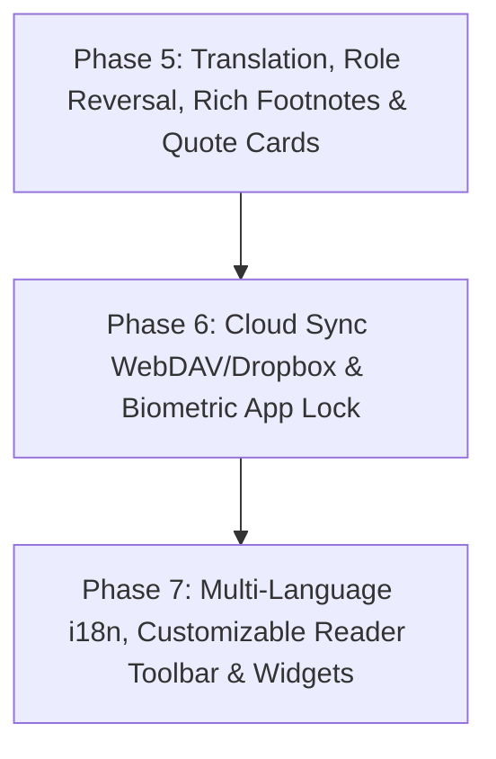

# 📖 Readr Upcoming Features Implementation Plan

This document contains only the features that are **not yet implemented** in Readr, structured into actionable implementation phases.

---

## 📊 Unimplemented Feature Matrix

| Feature Area | Sub-Feature | Implementation Strategy |
| :--- | :--- | :--- |
| **Reference & Study** | In-App Instant Translation Sheet | Translation modal with source/target language selection & text-to-speech pronunciation |
| | External Dictionary Deep-Linking | Intent deep linking for ColorDict, GoldenDict, ABBYY Lingvo, Google Translate |
| | Name Replacement / Role Reversal Engine | Regex character substitution altering names across the active book stream |
| | Inline Rich Footnote Popups | Intercept footnote link tags and display floating popover card above footnote marker |
| | Quote Card Share Generator | Visual card image renderer with book cover, typography quote, and author attribution |
| **Sync & Security** | WebDAV & Dropbox Cloud Sync | Two-way sync of reading progress, bookmarks, notes, and highlights across devices |
| | Biometric Authentication & PIN Lock | `expo-local-authentication` Face ID / Fingerprint / PIN unlock on app start and resume |
| **Localization & UI** | Multi-Language Localization (i18n) | `i18n-js` translation files for 10+ core languages with language selector |
| | Customizable Reader Toolbar | Reorder and toggle visibility of header & bottom capsule action buttons |
| | Diagnostic Support Helper | `mailto:` launcher bundling anonymized device metrics and logs |
| | Home Screen App Shortcuts & Widgets | Expo Quick Actions / App shortcuts integration |

---

## 🏗️ Remaining Phased Roadmap

---

## 🔍 Phase 5: Reference Tools, Translation, Role Reversal & Rich Footnotes

### 1. In-App Instant Translation Sheet
- **File**: `src/components/reader/TranslationSheet.tsx`
- **Description**: Highlight any sentence or paragraph $\to$ open instant translation sheet.
- **Features**:
  - Source language auto-detection.
  - Target language selector (English, Spanish, French, German, Chinese, Japanese, Russian, Hindi, Portuguese, Italian, Arabic, etc.).
  - Pronunciation audio playback.
  - "Save to Vocabulary / Notes" quick button.

### 2. Deep-Linking to External Dictionaries
- **File**: `src/services/dictionary/externalDictionaryService.ts`
- **Description**: Deep-link intents for installed dictionary and translation apps:
  - ColorDict (`colordict://...`)
  - GoldenDict (`goldendict://...`)
  - ABBYY Lingvo (`lingvo://...`)
  - Google Translate app (`googletranslate://...`)
  - Web fallback lookup.

### 3. Name Replacement / Role Reversal Engine
- **File**: `src/components/reader/NameReplacementModal.tsx` & `src/utils/nameReplacer.ts`
- **Description**: Allows users to alter character names or terms dynamically in the reading stream without modifying underlying e-book files.
- **Features**:
  - Add Find/Replace pairs (e.g. `Find: "Sherlock Holmes"` $\to$ `Replace: "Detective Alex"`).
  - Match case / Case-insensitive rules.
  - Per-book persistence in SQLite.

### 4. Inline Rich Footnote Popups
- **File**: `src/components/reader/FootnotePopover.tsx`
- **Description**: Intercept `<a href="#note*">` and `<aside epub:type="footnote">` tags.
- **Features**:
  - Render an elegant floating popover card directly above the tapped footnote marker.
  - Dismissible with backdrop tap or close button.
  - Prevents jumping to the end of the chapter.

### 5. Quote Card Share Image Generator
- **File**: `src/components/reader/QuoteCardGenerator.tsx`
- **Description**: Turn highlighted passages into beautiful shareable visual cards.
- **Features**:
  - Multiple aesthetic card templates (Minimalist, Dark OLED, Vintage Parchment, Gradient Glow).
  - Book cover thumbnail, quote text, author attribution, and page/chapter footer.
  - Native image sharing via `expo-sharing`.

---

## 🔒 Phase 6: Cloud Sync & Biometric Security

### 1. WebDAV & Dropbox Cloud Sync
- **File**: `src/services/sync/webdavSyncService.ts` & `src/components/settings/CloudSyncModal.tsx`
- **Description**: Universal two-way cloud sync for reading progress, bookmarks, highlights, and tags.
- **Features**:
  - Connect to private Nextcloud, ownCloud, Synology NAS, or standard WebDAV servers.
  - Dropbox REST API synchronization.
  - Conflict resolution preferring the latest `updatedAt` timestamp.
  - Auto-sync on book open/close or manual one-tap sync.

### 2. Biometric Authentication & Passcode Lock
- **File**: `src/components/common/AppLockScreen.tsx`
- **Description**: Secure private reading vault with biometric verification.
- **Features**:
  - `expo-local-authentication` integration for Face ID, Touch ID, or Android Fingerprint.
  - Fallback 4-to-6 digit PIN passcode with auto-lock timer (Immediate, 1 min, 5 mins, 15 mins).
  - Lock on app launch and background-to-foreground app resume.

---

## 🌐 Phase 7: Localization, Interface Customizer & Widgets

### 1. Multi-Language Localization (i18n)
- **File**: `src/i18n/index.ts` and language translation JSONs
- **Description**: Complete multi-language UI localization:
  - English (`en`), Spanish (`es`), French (`fr`), German (`de`), Japanese (`ja`), Chinese (`zh`), Russian (`ru`), Hindi (`hi`), Portuguese (`pt`), Italian (`it`).
  - Dynamic in-app language switcher in Settings.

### 2. Customizable Reader Chrome & Action Bar
- **File**: `src/components/reader/ToolbarCustomizerModal.tsx`
- **Description**: Allow users to configure header and bottom capsule quick actions:
  - Re-order and toggle action icons (TTS, Ruler, Bionic, Search, Bookmark, Theme, Notes, Translation, Speedometer).
  - Hide unused tools for an ultra-minimal reading interface.

### 3. Diagnostic Support Mailer
- **File**: `src/components/settings/SupportModal.tsx`
- **Description**: Easy support and feedback tool:
  - `mailto:` intent launcher with pre-filled anonymized device diagnostics (OS version, app build, screen dimensions, active theme).

### 4. Home Screen Shortcuts & Quick Actions
- **File**: `src/services/shortcuts/quickActionsService.ts`
- **Description**: Long-press app icon quick shortcuts to resume reading the last book or open the OPDS Net Library directly.

---

## 🧪 Verification & Acceptance Criteria
- **Unit Tests**: Add test suites covering translation API parsing, name replacement regex, footnote extraction, WebDAV serialization, and PIN authentication.
- **TypeScript**: Maintain 0 compilation errors across all new modules.
- **Data Sovereignty**: Maintain 100% offline capability for all local features.
