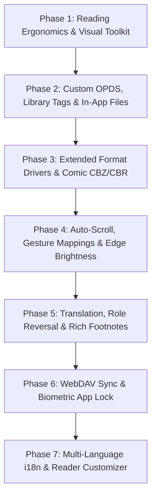

# 📖 Readr Comprehensive Feature Implementation Plan & Roadmap

This document provides a systematic gap analysis of all requested features against the current Readr codebase (v1.1.0-beta), followed by a modular, phased implementation plan.

---

## 📊 Feature Audit Matrix

| Feature Area | Sub-Feature | Status in Readr | Implementation Strategy |
| :--- | :--- | :---: | :--- |
| **Supported Formats** | EPUB, PDF, TXT, MD | ✅ Present | Handled by format drivers (`EpubDriver`, `PdfDriver`, `TxtDriver`) |
| | CBZ, CBR (Comics) | 🟡 Partial | Format driver interface ready; add comic archive extractor & image page carousel |
| | MOBI, AZW3, FB2, PRC | ❌ Missing | Implement format parser modules converting binary records to structured chapter DOM |
| | DJVU, CHM, UMD, DOCX, ODT, RTF, HTML | ❌ Missing | Add lightweight text/document unpackers for document interchange formats |
| **Library & Shelf** | Favorites, search, cover art enrichment, OPDS public domain | ✅ Present | In `useLibrary`, `metadataService`, and `opdsService` |
| | Custom Calibre / OPDS Server connection | ❌ Missing | Custom OPDS endpoint manager with HTTP Basic Auth and feed XML parser |
| | Tagging & Category Organization | 🟡 Partial | DB schema has `tags`/`collections`; build Tag selector chips and filter views |
| | Full-featured "My Files" in-app browser | ❌ Missing | File system directory navigator for local storage, SD card, and download folders |
| | Per-Book Settings (individual font/theme) | ❌ Missing | Add `book_settings` table in SQLite; load book-specific overrides on reader launch |
| | Book 1-5 Star Ratings & Rating Sort | ❌ Missing | Add `rating` column in `books` table; rating stars modal & sorting algorithm |
| | Home Screen App Shortcuts / Widgets | ❌ Missing | Expo Quick Actions / App shortcuts integration |
| **Customization** | Typography (scale, fonts, alignment, line-height, margins) | ✅ Present | `TypographySheet.tsx` & `readerStore.ts` |
| | 10+ Built-in Color Themes | 🟡 Partial | 5 themes present; expand to 12 themes (Forest, Slate, Solarized, Nordic, etc.) |
| | Blue Light Filter (0-95%) | 🟡 Partial | Warmth slider present; expand to 0-95% Kelvin tint overlay with scheduled auto-mode |
| | Reading Ruler for Focus (6 styles) | ❌ Missing | Floating guide overlay (Underline, Highlight Bar, Dim Background, Dual Bar, Focus Box, Laser Line) |
| | Custom User Fonts (.ttf/.otf loader) | ❌ Missing | Document picker for `.ttf`/`.otf` files loaded dynamically into `expo-font` |
| | Custom Background Textures/Images | ❌ Missing | Wallpaper picker for parchment, paper textures, subtle linen canvas |
| | Dual-Page Mode (Landscape/Tablet) | ❌ Missing | CSS/Flex 2-column spread when screen width > 600dp or in landscape orientation |
| | 4-Way Screen Orientation Lock | ❌ Missing | `expo-screen-orientation` lock controls (Portrait, Landscape, Reverse, Sensor) |
| | Intelligent Paragraph Formatting (indent, drop caps) | ❌ Missing | Typography options for first-line indentation, drop caps, and blank line collapsing |
| | Hyphenation Mode | ❌ Missing | Soft-hyphen injection and CSS auto-hyphenation |
| | Tilt-to-Turn Gestures | ❌ Missing | `expo-sensors` Accelerometer listener with sensitivity thresholds |
| **Navigation & Controls** | Double-tap toggle, edge tap, on-screen buttons, volume keys | ✅ Present | `EpubReader.tsx`, `ReaderBottomCapsule.tsx` |
| | Vertical Edge-Swipe Brightness Control | ❌ Missing | Left-edge pan gesture listener controlling screen brightness via `expo-brightness` |
| | 5 Auto-Scroll Modes & Speed Controller | ❌ Missing | Auto-scroll engine (Smooth pixel, Rolling blind, Line jump, Timed page flip, Page slide) |
| | 24 Customizable Action Mappings | ❌ Missing | 9-zone touch grid & gesture mapping table configured in Settings |
| | Bluetooth & Headset Remote Key Control | ❌ Missing | Hardware media key listener (Play/Pause, Track Next/Prev) mapped to page navigation |
| **Annotation & Reference** | Highlights, Notes, Bookmarks, Offline Dictionary, Text Search | ✅ Present | `AnnotationSheet`, `DictionarySheet`, `SearchSheet` |
| | Deep Linking to External Dictionaries | ❌ Missing | Intent deep linking for ColorDict, GoldenDict, ABBYY Lingvo, Google Translate app |
| | In-App Translation Sheet | ❌ Missing | Translation modal with source/target language selection via translation API |
| | Name Replacement / Role Reversal | ❌ Missing | Regex word-replacement engine altering character names across the active book |
| | EPUB3 Multimedia & Popup Footnotes | ❌ Missing | Inline footnote `<aside epub:type="footnote">` popover modal without page jumping |
| | Quote Card Share Generator | ❌ Missing | Visual card image renderer with book cover, styled quote, author, and sharing |
| **Text-to-Speech (TTS)** | Speech playback, rate/pitch sliders, sleep timer, voices | ✅ Present | `ttsService.ts`, `TTSSheet.tsx` |
| | Shake-to-Activate Speech | ❌ Missing | `expo-sensors` accelerometer shake detector to toggle narration |
| **PDF Tools** | PDF text parsing & chapter layout | ✅ Present | `PdfDriver.ts` |
| | PDF Visual Annotations & Freehand Ink | ❌ Missing | Canvas overlay for drawing, highlighter pens, and note stamps |
| | PDF Smart Scroll Lock | ❌ Missing | Horizontal pan lock keeping zoom aligned to reading column |
| | 6 PDF-Specific Night/Contrast Modes | ❌ Missing | Invert, Sepia High-Pass, Grayscale, Dark OLED Invert, Night Vision, Blue-Cut |
| | PDF Dual-Page Spread | ❌ Missing | Dual-canvas rendering in landscape mode |
| **Sync, Backup & Security** | Local SQLite Sovereignty & JSON `.readr` Backup | ✅ Present | `backupService.ts`, `settings.tsx` |
| | WebDAV & Dropbox Cloud Sync | ❌ Missing | WebDAV client for Nextcloud/Synology and Dropbox REST API sync engine |
| | Biometric Authentication & Passcode Lock | ❌ Missing | `expo-local-authentication` biometric prompt on app startup with PIN fallback |
| **Pro Extras & Polish** | 100% Ad-Free, SQLite Performance, Lifetime Stats | ✅ Present | `stats.tsx`, `RecentSessionsList.tsx`, `ReadingGraph` |
| | Customizable Reader Toolbar | ❌ Missing | Reorder and toggle visibility of header & bottom capsule action buttons |
| | Multi-Language Localization (i18n) | ❌ Missing | `i18n-js` translation files for 10+ core languages |
| | Diagnostic Email Support Helper | ❌ Missing | `mailto:` launcher bundling anonymized device metrics and logs |

---

## 🏗️ Phased Implementation Plan

---

### 🚀 Phase 1: Reading Ergonomics & Visual Toolkit
**Goal**: Elevate reader customization to industry-leading standards.

1. **Expanded Theme Suite (12 Themes)**:
   - Add: Forest Green (`#16231C`), Slate (`#1E293B`), Solarized Dark (`#002B36`), Solarized Light (`#FDF6E3`), Rose Pine (`#191724`), Nord (`#2E3440`), Parchment Warm (`#F4ECD8`), Amber Glow (`#1F1610`).
   - Store theme presets in `src/utils/theme.ts`.
2. **Reading Ruler**:
   - Create `src/components/reader/ReadingRuler.tsx`.
   - 6 Modes: Underline, Highlight Strip, Dim Background Mask, Dual Focus Lines, Focus Box, Laser Guideline.
   - Draggable vertical tracking with touch follow.
3. **Custom Fonts & Backgrounds**:
   - Allow user to pick `.ttf` / `.otf` from filesystem and register dynamically with `expo-font`.
   - Add background image/texture overlay with opacity slider.
4. **Hyphenation, Indentation & Drop Caps**:
   - Add first-line indent (`text-indent: 1.5em`), drop cap initial styling, and paragraph margin controls in `EpubReader.tsx`.
5. **Dual-Page Landscape Mode**:
   - Detect screen width / tablet orientation; switch reading view to 2-column spread.

---

### 📂 Phase 2: Library Tags, Custom OPDS & In-App File Browser
**Goal**: Power-user library management and custom catalog discovery.

1. **Custom OPDS Server Manager**:
   - Create `src/components/library/CustomOPDSModal.tsx`.
   - Support Calibre Content Server, Kavita, Komga, and Standard Ebooks custom URL feeds with HTTP Basic Authentication.
2. **Tagging & Rating System**:
   - Update SQLite schema with `book_tags` and `rating` (1 to 5 stars).
   - Add Star rating selector in `RadialOptionsMenu.tsx` / `BookDetailsModal.tsx`.
   - Add Tag filter chips in `FilterBar.tsx`.
3. **In-App "My Files" Storage Browser**:
   - Create `src/components/library/FileBrowserModal.tsx`.
   - Browse internal storage folders, SD card paths, and Downloads directory directly.
   - Batch import multiple e-books with one tap.
4. **Per-Book Settings**:
   - Store book-specific overrides (`fontSize`, `fontFamily`, `themeId`, `marginHorizontal`) in `book_settings` table.
   - Reader initializes with per-book setting if present, otherwise global fallback.

---

### 📚 Phase 3: Format Driver Expansion (CBZ, CBR, MOBI, FB2, DOCX)
**Goal**: Read any digital book format seamlessly.

1. **Comic Driver (`CbzDriver`, `CbrDriver`)**:
   - Unzip image archives (`.cbz`, `.zip`, `.cbr`).
   - Build dual-mode comic reader (Fit to Width vertical scroll vs. Page-by-page pinch-to-zoom).
2. **MOBI & AZW3 Driver (`MobiDriver`)**:
   - Parse PalmDOC compression and Mobipocket record headers into standard chapter HTML.
3. **FB2 & FictionBook Driver (`Fb2Driver`)**:
   - XML parser extracting base64 inline images and structured `
` / `<section>` trees.
4. **DOCX & RTF Driver (`DocxDriver`, `RtfDriver`)**:
   - Unpack DOCX XML (`word/document.xml`) into clean HTML blocks.

---

### ⚡ Phase 4: Navigation, Gestures & Auto-Scroll Engine
**Goal**: Effortless, hands-free and hardware-integrated navigation.

1. **Edge-Swipe Brightness Control**:
   - Add PanResponder on the left 20px screen edge to adjust screen brightness directly via `expo-brightness` without leaving the book.
2. **5-Mode Auto-Scroll Engine**:
   - Implement `src/services/reader/autoScrollEngine.ts`.
   - Modes:
     - Continuous Smooth Pixel Glide
     - Rolling Blind (Teleprompter mode with top highlight bar)
     - Line Jump
     - Timed Page Flip
     - Smooth Page Slide
   - Floating HUD with real-time Speed Stepper (`WPM` or `px/s`) and Pause/Resume button.
3. **24-Zone Action Mapping**:
   - Configurable 3x3 touch grid (Top-Left, Top-Center, Top-Right, Center-Left, Center, Center-Right, Bottom-Left, Bottom-Center, Bottom-Right).
   - Map each zone to: Next Page, Prev Page, Bookmark, Dictionary, Chrome Toggle, Search, TTS Narration, Theme Switch, Auto-Scroll.
4. **Sensors & Remote Keys**:
   - Shake-to-Speech narration toggle using `expo-sensors` Accelerometer.
   - Tilt-to-Turn page gesture with configurable angle threshold.
   - Headset / Bluetooth media key listener.

---

### 🔍 Phase 5: Reference Tools, Translation & Role Reversal
**Goal**: Deep study tools, language translation, and personalized reading.

1. **In-App Instant Translation**:
   - Create `src/components/reader/TranslationSheet.tsx`.
   - Highlight any passage $\to$ instant translation modal with language picker and pronunciation audio.
2. **External Dictionary Deep-Linking**:
   - Configure deep links to open selected words in ColorDict, GoldenDict, ABBYY Lingvo, or Google Translate app.
3. **Name Replacement / Role Reversal Engine**:
   - Create `src/components/reader/NameReplacementModal.tsx`.
   - Create rule pairs (e.g. `Find: "Sherlock Holmes"` $\to$ `Replace: "Detective Alex"`).
   - Dynamically substitute names in the reader rendering stream while preserving original book data.
4. **Rich Footnote Popup Modals**:
   - Intercept `<a href="#note*">` tags in EPUBs.
   - Display note text in an elegant floating popover above the footnote marker instead of jumping to the end of the chapter.
5. **Quote Card Share Image Generator**:
   - Create `src/components/reader/QuoteCardGenerator.tsx`.
   - Render beautiful shareable snapshot cards with typographic quotes, book cover thumbnail, and author attribution.

---

### 🔒 Phase 6: Cloud Sync & Biometric Security
**Goal**: Universal sync and private vault security.

1. **WebDAV & Dropbox Cloud Sync**:
   - Create `src/services/sync/webdavSyncService.ts`.
   - Two-way sync of reading progress, bookmarks, notes, and highlights across devices.
   - Conflict resolution preferring the latest `updatedAt` timestamp.
2. **Biometric App Lock & PIN**:
   - Create `src/components/common/AppLockScreen.tsx`.
   - Use `expo-local-authentication` for Face ID / Fingerprint unlock on app cold start / resume.
   - Optional PIN passcode fallback.

---

### 🌐 Phase 7: Localization & Interface Customizer
**Goal**: Global language accessibility and personalized reader UI.

1. **Multi-Language Localization (i18n)**:
   - Setup `i18n-js` with translation files: English (`en`), Spanish (`es`), French (`fr`), German (`de`), Japanese (`ja`), Chinese (`zh`), Russian (`ru`), Hindi (`hi`), Portuguese (`pt`).
   - Language selector in Settings.
2. **Customizable Reader Chrome**:
   - Reader toolbar & bottom capsule layout editor: toggle and re-order action icons to fit user preference.
3. **Diagnostic Support Mailer**:
   - Feedback modal generating an email with attached app version, platform, and anonymized logs.

---

## 📈 Quality Assurance & Testing Plan
- **Unit Tests**: Maintain 100% test coverage on all format parsers, auto-scroll math, name replacement regex, and sync reconciliation.
- **TypeScript Strictness**: 0 `tsc --noEmit` errors across all new drivers and components.
- **Offline Sovereignty Guarantee**: All reading, formatting, search, and annotation features function 100% offline with zero cloud telemetry.
