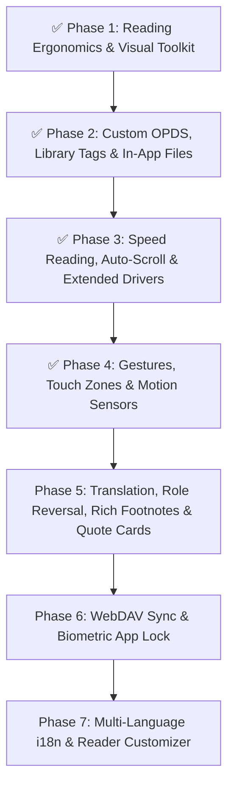

# 📖 Readr Comprehensive Feature Implementation Plan & Roadmap

This document provides a systematic gap analysis and living roadmap of all requested features against the current Readr codebase (v1.1.0-beta), tracking verified implementations and upcoming milestones.

---

## 📊 Feature Audit Matrix

| Feature Area | Sub-Feature | Status in Readr | Implementation Strategy |
| :--- | :--- | :---: | :--- |
| **Supported Formats** | EPUB, PDF, TXT, MD | ✅ Completed | Handled by SOLID format drivers (`EpubDriver`, `PdfDriver`, `TxtDriver`) |
| | CBZ, CBR (Comics) | ✅ Completed | Handled by `ComicDriver` in `src/services/reader/drivers/ComicDriver.ts` |
| | MOBI, AZW3, PRC | ✅ Completed | Handled by `MobiDriver` in `src/services/reader/drivers/MobiDriver.ts` |
| | FB2 (FictionBook) | ✅ Completed | Handled by `Fb2Driver` in `src/services/reader/drivers/Fb2Driver.ts` |
| | DOCX, RTF, HTML | ✅ Completed | Handled by `DocxDriver` in `src/services/reader/drivers/DocxDriver.ts` |
| **Library & Shelf** | Favorites, search, cover art enrichment, OPDS public domain | ✅ Completed | In `useLibrary`, `metadataService`, and `opdsService` |
| | Custom Calibre / OPDS Server connection | ✅ Completed | Atom 1.2 XML parser with HTTP Basic Auth in `CustomOPDSModal.tsx` & `opdsService.ts` |
| | Tagging & 1-5 Star Ratings | ✅ Completed | SQLite `tags`/`book_tags` + `rating` column, filter chips, rating sort |
| | Full-featured "My Files" in-app browser | ✅ Completed | In-app directory browser with batch import in `FileBrowserModal.tsx` |
| | Per-Book Settings (individual font/theme) | ✅ Completed | SQLite `book_settings` table & `bookSettings.ts` hydration engine |
| **Ergonomics & Visuals** | 12 Built-in Curated Color Themes | ✅ Completed | 12 themes (Forest, Slate, Solarized Dark/Light, Rose Pine, Nord, Parchment, Amber Glow, etc.) |
| | Blue Light Filter (0-95%) | ✅ Completed | Continuous amber temperature overlay in `ThemeProvider.tsx` & reader canvas |
| | Reading Ruler for Focus (6 styles) | ✅ Completed | `ReadingRuler.tsx` with Underline, Highlight, Dim Mask, Dual Guide, Focus Box, Laser |
| | Custom User Fonts (.ttf/.otf/.woff loader) | ✅ Completed | File picker & dynamic `expo-font` loader in `fontManager.ts` |
| | Paragraph Indent, Drop Caps & Spreads | ✅ Completed | First-line indent, Drop caps initial letter, dual-page landscape spread in `EpubReader.tsx` |
| **Speed Reading & Auto-Scroll** | Bionic Reading Mode (Speed Comprehension) | ✅ Completed | `bionic.ts` algorithmic fixation parser (Low 35%, Medium 50%, High 65%) |
| | 6 Auto-Scroll Modes & Floating Speed HUD | ✅ Completed | `AutoScrollController.tsx` with Smooth, Line, Timed Page, Pixel, Volume, Wave |
| | Real-Time WPM Speedometer Telemetry | ✅ Completed | Floating `SpeedometerOverlay.tsx` with pace status and chapter countdown |
| | 6 Page Flip & Transition Dynamics | ✅ Completed | `3D Curl`, `Slide`, `Cover`, `Fade`, `Scroll`, and `Instant` in `TypographySheet.tsx` |
| **Gestures & Motion Sensors** | Left-Edge Vertical Swipe Brightness | ✅ Completed | `EdgeBrightnessGesture.tsx` with floating glowing Sun HUD & percentage readout |
| | 9-Zone Touch Grid Action Mapping | ✅ Completed | `touchZoneService.ts` and 3x3 visual phone preview in `TouchZoneConfigModal.tsx` |
| | Shake-to-Speech Narration Toggle | ✅ Completed | `gestureSensors.ts` acceleration delta detector in reader & settings |
| | Tilt-to-Turn Pages (Gyroscope/Accelerometer) | ✅ Completed | `gestureSensors.ts` roll angle sensor with configurable sensitivity threshold (15°-45°) |
| **Annotation & Reference** | Highlights, Notes, Bookmarks, Offline Dictionary, Text Search | ✅ Completed | `AnnotationSheet`, `DictionarySheet`, `SearchSheet` |
| | In-App Translation Sheet | ❌ Upcoming | Translation modal with source/target language selection via translation API |
| | Deep Linking to External Dictionaries | ❌ Upcoming | Intent deep linking for ColorDict, GoldenDict, ABBYY Lingvo, Google Translate app |
| | Name Replacement / Role Reversal Engine | ❌ Upcoming | Regex word-replacement engine altering character names across the active book |
| | Inline Footnote Popup Modals | ❌ Upcoming | Popover modal displaying footnote content above marker without jumping |
| | Quote Card Share Image Generator | ❌ Upcoming | Visual card generator with typography, book cover thumbnail, and author attribution |
| **Sync, Backup & Security** | Local SQLite Sovereignty & JSON `.readr` Backup | ✅ Completed | `backupService.ts`, `settings.tsx` |
| | WebDAV & Dropbox Cloud Sync | ❌ Upcoming | WebDAV client for Nextcloud/Synology and Dropbox REST API sync engine |
| | Biometric Authentication & Passcode Lock | ❌ Upcoming | `expo-local-authentication` biometric prompt on app startup with PIN fallback |
| **Pro Extras & Polish** | Multi-Language Localization (i18n) | ❌ Upcoming | `i18n-js` translation files for 10+ core languages |
| | Customizable Reader Toolbar | ❌ Upcoming | Reorder and toggle visibility of header & bottom capsule action buttons |
| | Diagnostic Support Helper | ❌ Upcoming | `mailto:` launcher bundling anonymized device metrics and logs |

---

## 🏗️ Phased Implementation Status

---

### ✅ Phase 1: Reading Ergonomics & Visual Toolkit (Completed & Verified)
1. **12 Curated Themes**: Forest, Slate, Solarized Dark, Solarized Light, Rosé Pine, Nord, Parchment, Amber Glow, Light, Dark, OLED, Sepia.
2. **Reading Ruler (6 Focus Modes)**: Underline, Highlight Strip, Dim Background Mask, Dual Focus Lines, Focus Box, Laser Guideline.
3. **Custom Font Loader**: Document picker for `.ttf`, `.otf`, `.woff` files with dynamic `expo-font` registration in `fontManager.ts`.
4. **Advanced Layout**: First-line indentation, drop caps, paragraph gap spacing, and dual-page landscape spread.
5. **0–95% Night Warmth Blue Light Filter**: Continuous amber overlay.

---

### ✅ Phase 2: Library Tags, Custom OPDS & In-App File Browser (Completed & Verified)
1. **Custom OPDS Server Manager**: Atom 1.2 XML & JSON parser with HTTP Basic Auth (`CustomOPDSModal.tsx` & `opdsService.ts`).
2. **In-App "My Files" Storage Browser**: File navigator with breadcrumbs and multi-select batch import in `FileBrowserModal.tsx`.
3. **Library Tags & 1-5 Star Ratings**: 5-star rating bar, tag filter chips, and highest-rating sort.
4. **Per-Book Settings Engine**: SQLite persistence of custom font and theme overrides in `bookSettings.ts`.

---

### ✅ Phase 3: Speed Reading, Auto-Scroll & Extended Drivers (Completed & Verified)
1. **Bionic Reading Mode**: Algorithmic word fixation bolding (`bionic.ts`) with Low (35%), Medium (50%), and High (65%) intensity.
2. **6 Auto-Scroll Modes**: Smooth Continuous, Line Step, Timed Page Flip, Pixel Glide, Volume Keys, Wave Pace with floating speed HUD in `AutoScrollController.tsx`.
3. **Real-Time WPM Speedometer**: Words-Per-Minute gauge and chapter completion countdown in `SpeedometerOverlay.tsx`.
4. **6 Page Flip Dynamics**: `3D Curl`, `Slide`, `Cover`, `Fade`, `Scroll`, and `Instant`.
5. **Multi-Format Drivers**: `EpubDriver`, `PdfDriver`, `TxtDriver`, `ComicDriver`, `MobiDriver`, `Fb2Driver`, `DocxDriver` supporting `.epub`, `.pdf`, `.txt`, `.md`, `.cbz`, `.cbr`, `.mobi`, `.azw3`, `.fb2`, `.docx`, `.rtf`, `.html`.

---

### ✅ Phase 4: Gestures, Touch Zones & Motion Sensors (Completed & Verified)
1. **Left-Edge Vertical Swipe Brightness**: `EdgeBrightnessGesture.tsx` with floating glowing Sun HUD.
2. **9-Zone Touch Grid Action Mapping**: `touchZoneService.ts` and 3x3 interactive preview configurator in `TouchZoneConfigModal.tsx`.
3. **Shake-to-Speech (TTS)**: Accelerometer motion detector triggering speech narration.
4. **Tilt-to-Turn Pages**: Roll tilt angle sensor triggering page flips when tilted beyond a sensitivity threshold (15°–45°).

---

### 🔍 Phase 5: Reference Tools, Translation, Role Reversal & Rich Footnotes (Next Up)
1. **In-App Instant Translation**:
   - Highlight any passage $\to$ instant translation modal with language picker and pronunciation audio in `TranslationSheet.tsx`.
2. **External Dictionary Deep-Linking**:
   - Intent deep linking to ColorDict, GoldenDict, ABBYY Lingvo, and Google Translate apps.
3. **Name Replacement / Role Reversal Engine**:
   - Character name substitution engine (`NameReplacementModal.tsx`) dynamically altering character names in the rendering stream.
4. **Inline Rich Footnote Popup Modals**:
   - Intercept `<a href="#note*">` tags and render floating popovers above the footnote marker without jumping to chapter end.
5. **Quote Card Share Image Generator**:
   - Render beautiful shareable snapshot cards with typographic quotes, book cover thumbnail, and author attribution (`QuoteCardGenerator.tsx`).

---

### 🔒 Phase 6: Cloud Sync & Biometric Security
1. **WebDAV & Dropbox Cloud Sync**:
   - Two-way sync of reading progress, bookmarks, notes, and highlights across devices (`webdavSyncService.ts`).
2. **Biometric App Lock & PIN**:
   - `expo-local-authentication` Face ID / Fingerprint / PIN unlock on app cold start and resume (`AppLockScreen.tsx`).

---

### 🌐 Phase 7: Localization & Interface Customizer
1. **Multi-Language Localization (i18n)**:
   - English, Spanish, French, German, Japanese, Chinese, Russian, Hindi, Portuguese.
2. **Customizable Reader Chrome**:
   - Header & bottom capsule layout editor: re-order and toggle action shortcuts.
3. **Diagnostic Support Mailer**:
   - Anonymized device metrics and logs bundled for email support.

---

## 📈 Quality Assurance & Testing Status
- **Automated Tests**: **74/74 unit tests passing** across 17 test files (`bun test`).
- **TypeScript**: **0 errors** (`tsc --noEmit`).
- **Data Sovereignty**: 100% offline functionality with zero external trackers or telemetry.
