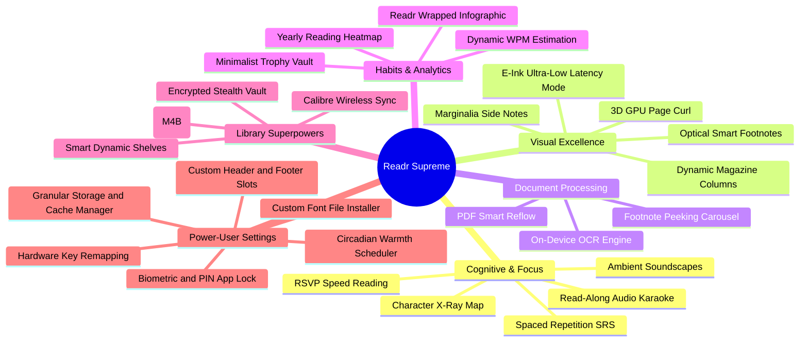

# Readr — Technical Implementation Blueprint & Feature Proposals

> **Vision**: To make **Readr** the undisputed pinnacle of digital reading software — combining 100% local data sovereignty, distraction-free optical beauty, cognitive acceleration tools, deep reading analytics, and an unmatched power-user customization engine.

## Guiding Pillars & Architecture



## 1. Cognitive & Immersive Focus Tools

### 1.1 RSVP Rapid Serial Visual Presentation (Speed Reading Engine)
- **Concept**: Stream words sequentially in a fixed visual focal window at 200–1,000 WPM with the **Optimal Recognition Point (ORP)** highlighted in amber, eliminating saccadic eye movement fatigue.
- **Files to Create / Modify**:
  - `src/types/rsvp.ts`: Define `RSVPConfig`, `RSVPWordToken`, `RSVPState`.
  - `src/utils/rsvpParser.ts`: Word tokenizer, punctuation delay calculator, ORP index calculation.
  - `src/components/reader/RSVPReaderModal.tsx`: High-performance modal overlay with play/pause, scrub slider, and WPM dial.
  - `src/store/readerStore.ts`: Add `rsvpWpm`, `isRsvpActive`, `rsvpCurrentIndex` state slices.
- **Data Models & Types**:
  ```ts
  export interface RSVPWordToken {
    text: string;
    orpIndex: number;      // Optimal Recognition Point character index (typically 30-35% into word)
    delayMultiplier: number; // 1.0 standard, 1.8 for periods/colons, 1.4 for commas, 1.5 for long words (>10 chars)
  }
  export interface RSVPConfig {
    targetWpm: number;      // 200 to 1000 WPM
    pauseOnPunctuation: boolean;
    orpAccentColor: string; // Theme accent color
    fontScale: number;      // 1.0 to 2.5
  }
  ```
- **Core Algorithms & Logic**:
  - **ORP Calculation**: For word length $L$:
    $$\text{ORP Index} = \begin{cases} 0 & L = 1 \\ 1 & 2 \le L \le 5 \\ 2 & 6 \le L \le 9 \\ 3 & 10 \le L \le 13 \\ 4 & L \ge 14 \end{cases}$$
  - **Interval Timing**: Base interval $T = \frac{60,000}{\text{WPM}}$ ms. Actual interval for token $= T \times \text{delayMultiplier}$.
- **UI / UX Component**:
  - Modal overlay with centered letterbox.
  - Word display split into 3 text spans: `[prefix, ORP_character (amber bold), suffix]` perfectly aligned on a vertical crosshair guide.
  - Bottom controls: Play/Pause toggle (spacebar trigger), $-50 / +50$ WPM steppers, progress scrubber with chapter percentage.
- **Acceptance Criteria**:
  - Tokenizer accurately splits hyphenated words, dialogue quotes, and terminal punctuation.
  - Frame pacing remains rock-solid without UI stuttering on 120Hz displays.

### 1.2 Offline Generative Ambient Audio Soundscapes
- **Concept**: Curated loopable ambient audio soundscapes mixed on-device to promote deep reading focus and alpha brainwave states.
- **Files to Create / Modify**:
  - `src/services/audio/ambientSoundService.ts`: Audio track loader, looping controller, crossfader.
  - `src/components/reader/AmbientAudioSheet.tsx`: Bottom sheet soundboard with volume sliders and theme selectors.
  - `src/types/ambient.ts`: `AmbientTrackId`, `AmbientPreset`, `AmbientMixState`.
- **Data Models & Types**:
  ```ts
  export type AmbientTrackId = 'rain_window' | 'crackling_hearth' | 'night_storm' | 'coffeehouse' | 'forest_stream' | 'brown_noise' | 'pink_noise';
  export interface AmbientSoundTrack {
    id: AmbientTrackId;
    title: string;
    icon: string;
    localAssetUri: any;
    volume: number; // 0.0 to 1.0
    isPlaying: boolean;
  }
  ```
- **Core Logic & Integration**:
  - Mixes simultaneously with TTS narration or operates standalone.
  - Automatic gentle fade-in (1.5s) on activation and smooth fade-out (3s) when the sleep timer triggers or reader unmounts.
  - Persists last active ambient preset per book in SQLite `book_settings`.
- **UI / UX Component**:
  - Grid cards with animated audio waveform badges when active.
  - Independent master volume slider with dual-track blending (e.g. 70% Rain + 30% Hearth).

### 1.3 Character Relationship Graph & Dramatis Personae (X-Ray Engine)
- **Concept**: Offline character relationship and entity tracker mapping character introductions, aliases, mentions, and allegiance links across complex novels.
- **Files to Create / Modify**:
  - `src/types/xray.ts`: `BookEntity`, `EntityMention`, `EntityRelationship`.
  - `src/db/schema/xray.ts`: `book_entities`, `entity_relationships`, `entity_mentions` tables.
  - `src/services/reader/xrayExtractor.ts`: Entity extraction heuristics and graph builder.
  - `src/components/reader/XRaySheet.tsx`: Interactive character relationship sheet and search filter.
- **Database Schema**:
  ```ts
  export const bookEntities = sqliteTable('book_entities', {
    id: text('id').primaryKey(),
    bookId: text('book_id').notNull().references(() => books.id, { onDelete: 'cascade' }),
    name: text('name').notNull(),
    aliasesJson: text('aliases_json'), // stringified JSON array
    role: text('role', { enum: ['protagonist', 'antagonist', 'supporting', 'minor', 'location', 'faction'] }),
    summary: text('summary'),
    firstChapterIndex: integer('first_chapter_index').notNull(),
    firstParagraphIndex: integer('first_paragraph_index').notNull(),
    totalMentions: integer('total_mentions').default(0),
  });
  ```
- **Core Algorithms & Logic**:
  - **Spoiler-Free Filter**: Queries only return mentions and relationships where `chapter_index <= current_book_chapter`.
  - **Entity Detection**: Heuristic extraction of capitalized honorifics (`Lord`, `Doctor`, `Lady`, `Captain`) and multi-word capitalized named entities.
- **UI / UX Component**:
  - Character drawer with search bar, avatar badge, frequency bar chart, and chapter jump links.
  - Relationship graph rendering nodes connected by relationship edges (*Friend*, *Rival*, *Sibling*, *Subordinate*).

### 1.4 Smart Vocabulary Builder & Spaced Repetition (SRS Flashcards)
- **Concept**: Converts in-book dictionary lookups into long-term vocabulary retention decks using the **SuperMemo-2 (SM-2)** algorithm.
- **Files to Create / Modify**:
  - `src/types/srs.ts`: `VocabularyCard`, `SRSReviewGrade`, `SRSMemberStats`.
  - `src/db/schema/vocabulary.ts`: `vocabulary_cards`, `vocabulary_reviews` tables.
  - `src/services/srs/srsEngine.ts`: SM-2 interval and ease factor calculator.
  - `src/components/library/VocabularyDeckModal.tsx`: Swipeable flashcard review UI with definition flipping.
- **Data Models & Types**:
  ```ts
  export interface VocabularyCard {
    id: string;
    word: string;
    definition: string;
    phonetic?: string;
    sentenceContext: string; // The exact sentence from the book
    bookTitle: string;
    intervalDays: number;
    repetitionCount: number;
    easeFactor: number;     // Initial 2.5
    nextReviewDate: string; // YYYY-MM-DD
  }
  ```
- **SM-2 Algorithm Implementation**:
  - Grade $q \in \{0, 1, 2, 3, 4, 5\}$ (0 = Blackout, 5 = Perfect recall).
  - New Ease Factor: $EF' = \max\left(1.3, EF + (0.1 - (5 - q) \times (0.08 + (5 - q) \times 0.02))\right)$.
  - Next Interval $I$:
    $$I(1) = 1, \quad I(2) = 6, \quad I(n) = \text{round}(I(n-1) \times EF')$$
- **UI / UX Component**:
  - 3D card flip animation revealing phonetic pronunciation, dictionary definition, and highlighted book quote.
  - 4 quick-action response buttons: *Again (1d)*, *Hard (3d)*, *Good (6d)*, *Easy (12d)*.

### 1.5 Read-Along Karaoke Narration (Word-Level Highlight Sync)
- **Concept**: Real-time synchronized sentence and word bounding box illumination matching active TTS speech synthesis.
- **Files to Create / Modify**:
  - `src/services/tts/karaokeSyncService.ts`: Speech boundary listener and word highlighter.
  - `src/components/reader/EpubReader.tsx`: High-performance text token renderer with active word border radius.
- **Core Logic & Integration**:
  - Subscribes to `expo-speech` or native TTS `onBoundary` callbacks returning `charIndex` and `charLength`.
  - Maps character offsets to active paragraph word index tokens.
  - Smooth auto-scrolling keeps the active spoken sentence centered vertically in the viewport with spring damping.
- **UI / UX Component**:
  - Active sentence rendered with subtle background wash (`rgba(accent, 0.12)`).
  - Spoken word highlighted with accent underline and glowing cursor pulse.

## 2. Optical Aesthetics & Visual Precision

### 2.1 Skia / GPU 3D Realistic Skeuomorphic Page Curl
- **Concept**: 120 FPS hardware-accelerated mesh deformation simulating physical paper bending, stiffness resistance, dynamic lighting, and dual-sided translucent page bleed-through.
- **Files to Create / Modify**:
  - `src/components/reader/canvas/PageCurlCanvas.tsx`: React Native Skia / Gesture Handler canvas.
  - `src/utils/meshCurlMath.ts`: Conical / cylindrical mesh deformation mathematics.
- **Mathematical Formula**:
  - Page point $(x, y)$ deformed along curl vector with radius of curvature $R$ and curl angle $\theta$:
    $$x' = x - (x - x_0)(1 - \cos\alpha), \quad z' = R \sin\alpha, \quad \text{where } \alpha = \frac{\text{distanceToFoldLine}}{R}$$
  - Specular lighting gradient: $I = I_{\text{ambient}} + I_{\text{specular}} \cdot (\vec{N} \cdot \vec{L})^p$.
- **UI / UX Component**:
  - Dragging from right edge curls page under user's finger. Releasing past 40% threshold snaps page forward; releasing prior springs back.
  - Dual-page mode on tablets renders left and right realistic center-spine shadow depression.

### 2.2 Dedicated E-Ink Optimization Mode
- **Concept**: Monochromatic, ultra-fast 1-bit rendering profile optimized specifically for E-Ink displays (Onyx Boox, Meebook, Bigme).
- **Files to Create / Modify**:
  - `src/utils/einkManager.ts`: Android E-Ink refresh trigger, animation killer, 1-bit contrast tuner.
  - `src/types/theme.ts`: Add `eink_white` and `eink_black` palette types.
- **Capabilities & Implementations**:
  - **Zero Animations**: Replaces all layout transitions, sliding sheets, and fade animations with immediate 0ms state changes.
  - **True 1-Bit Dithering**: Forces `#FFFFFF` canvas with `#000000` text without antialiasing fuzziness.
  - **Full-Screen Inversion Refresh**: Executes a programmatic 1-frame black-then-white inversion every $N$ page turns (configurable: 1, 5, 10, or 25 pages) to wipe ghosting particles.
  - **Hardware Key Support**: Listens for Android `KEYCODE_PAGE_UP` (92), `KEYCODE_PAGE_DOWN` (93), and DPAD button clicks.

### 2.3 Floating Marginalia & Margin Sticky Notes
- **Concept**: Write handwritten or typed notes directly in the side margins of the page, mimicking the feeling of studying a physical library hardcover.
- **Files to Create / Modify**:
  - `src/types/marginalia.ts`: `MarginNote`, `MarginNoteType`.
  - `src/db/schema/marginalia.ts`: `margin_notes` table.
  - `src/components/reader/MarginaliaGutter.tsx`: Responsive gutter container with note anchor pills.
- **Database Schema**:
  ```ts
  export const marginNotes = sqliteTable('margin_notes', {
    id: text('id').primaryKey(),
    bookId: text('book_id').notNull().references(() => books.id, { onDelete: 'cascade' }),
    chapterId: text('chapter_id').notNull(),
    paragraphIndex: integer('paragraph_index').notNull(),
    content: text('content').notNull(),
    colorTag: text('color_tag').default('amber'),
    createdAt: integer('created_at', { mode: 'timestamp' }).notNull(),
    updatedAt: integer('updated_at', { mode: 'timestamp' }).notNull(),
  });
  ```
- **UI / UX Component**:
  - On widescreen/tablets: Gutter width dynamically allocates 120px–180px for margin text.
  - On mobile devices: Floating collapsible note badge pinned to the paragraph edge. Tapping expands a rich popup card.

### 2.4 Adaptive Multi-Column Magazine Layout
- **Concept**: Smart auto-reflow into 2 or 3 balanced newspaper/journal columns on iPads, Android tablets, and foldable devices.
- **Files to Create / Modify**:
  - `src/utils/columnLayoutEngine.ts`: Balanced multi-column text divider.
  - `src/components/reader/MultiColumnReader.tsx`: Multi-column layout renderer.
- **Core Algorithms & Logic**:
  - Dynamically computes column count based on screen width:
    $$\text{Columns} = \begin{cases} 1 & \text{width} < 600\text{px} \\ 2 & 600\text{px} \le \text{width} < 1024\text{px} \\ 3 & \text{width} \ge 1024\text{px} \end{cases}$$
  - Balances column line heights to prevent orphan single lines at the base of column 1.
  - Renders an optical vertical separator line (`border-right: 1px solid theme.border`) with configurable opacity.

### 2.5 Optical Smart Footnotes & Inline Citations
- **Concept**: In-line footnote anchors that seamlessly expand content in-place without full-page jump navigation.
- **Files to Create / Modify**:
  - `src/utils/footnoteExtractor.ts`: Regex parser for EPUB `<a>` footnote and citation tags.
  - `src/components/reader/InlineFootnoteAccordion.tsx`: Animated collapsible accordion note card.
- **Core Logic & Implementation**:
  - Detects footnote patterns (`[1]`, `*1`, `href="#fn1"`, `epub:type="noteref"`).
  - Tapping footnote number expands an animated inline callout card directly below the target line with definition and citation source.

## 3. Document Processing & Advanced PDF Engine

### 3.1 PDF Smart Reflow & Layout Linearization
- **Concept**: Extracts text blocks from multi-column scanned academic PDFs and linearizes them into beautifully reflowed, resizable typography.
- **Files to Create / Modify**:
  - `src/services/reader/drivers/pdfReflowDriver.ts`: PDF text stream extractor and column ordering engine.
  - `src/types/pdfReflow.ts`: `PDFBlock`, `PDFColumnSegment`.
- **Core Algorithms & Logic**:
  - Parses PDF bounding boxes (`x0, y0, x1, y1`).
  - Clusters blocks by horizontal X-coordinates into vertical columns.
  - Orders blocks top-to-bottom within column 1 before progressing to column 2.
  - Strips repeating running headers (top 5% of page) and running footers (bottom 5% of page).

### 3.2 On-Device Offline OCR Engine
- **Concept**: Instant text recognition for image-only scanned books and historical documents.
- **Files to Create / Modify**:
  - `src/services/ocr/onDeviceOcrService.ts`: Local OCR processor and text layer overlay.
- **Capabilities & Implementations**:
  - 100% offline local OCR engine converting scanned pages into selectable text layers.
  - Enables instant dictionary lookups, text highlighting, and TTS audio narration on scanned image PDFs.

### 3.3 Footnote Peeking Carousel
- **Concept**: Floating carousel sheet for books with multiple cascading chapter citations.
- **Files to Create / Modify**:
  - `src/components/reader/FootnotePeekingModal.tsx`: Horizontal swipeable citation cards modal.
- **UI / UX Component**:
  - Horizontal swipeable card stack for books with multiple consecutive footnotes on a single page.
  - Direct jump-back breadcrumbs with scroll position memory.

## 4. Reading Psychology, Habits & Analytics

### 4.1 "Readr Wrapped" Yearly & Monthly Infographic Generator
- **Concept**: Spotify Wrapped-style shareable visual infographic summarizing total reading hours, top authors, fastest read, and streak records.
- **Files to Create / Modify**:
  - `src/services/stats/wrappedGenerator.ts`: Aggregate query builder and annual summary metrics.
  - `src/components/stats/ReadrWrappedModal.tsx`: Multi-slide animated story modal with vector card export.
- **Metrics Computed**:
  - Total minutes read & estimated words consumed ($M \times \text{WPM}$).
  - Circadian reading peak: Percentage of reading completed Morning (6AM–12PM), Afternoon (12PM–6PM), Night (6PM–12AM), Late Night (12AM–6AM).
  - Longest unbroken reading streak and longest continuous reading marathon.
  - Fastest completed book and top 3 author constellation.
- **Export Pipeline**:
  - Renders high-res 1080x1920 PNG card using `react-native-view-shot` and shares via `expo-sharing`.

### 4.2 Dynamic Machine-Learned Reading Speed & Finishing Predictor
- **Concept**: Pinpoint chapter completion prediction based on genre complexity and historical reading velocity.
- **Files to Create / Modify**:
  - `src/services/reader/adaptiveVelocityService.ts`: Genre-specific WPM moving average calculator.
- **Mathematical Model**:
  - Weighted exponential moving average:
    $$\text{WPM}_{\text{genre}}^{(t)} = \alpha \cdot \text{WPM}_{\text{session}} + (1 - \alpha) \cdot \text{WPM}_{\text{genre}}^{(t-1)}, \quad \alpha = 0.25$$
  - Displays dynamic finishing time: *"Chapter 5 finished at 11:14 PM (18 mins remaining at your current 240 WPM pace)"*.

### 4.3 Minimalist Trophy Vault & Habit Badges
- **Concept**: Elegant, non-intrusive habit milestone badges for personal motivation.
- **Files to Create / Modify**:
  - `src/types/trophy.ts`: `TrophyDefinition`, `UserTrophy`.
  - `src/db/schema/trophies.ts`: `user_trophies` table.
  - `src/services/stats/trophyEngine.ts`: Milestone evaluation engine triggered after every reading session.
  - `src/components/stats/TrophyVaultSheet.tsx`: Minimalist metallic badge grid.
- **Built-in Milestone Trophies**:
  - *The Marathoner*: Single continuous reading session exceeding 180 minutes.
  - *Midnight Scholar*: 15 sessions logged between 12:00 AM and 4:00 AM.
  - *Century Reader*: 100 total chapters completed.
  - *Bionic Pioneer*: 5 full books read with Bionic Reading enabled.
  - *Polymath*: Books finished across 5 distinct genres.

### 4.4 Interactive Reading Heatmap & Velocity Analytics
- **Concept**: GitHub-style 365-day reading activity calendar and velocity metrics.
- **Files to Create / Modify**:
  - `src/components/stats/ReadingHeatmapGrid.tsx`: 52-week activity matrix.
  - `src/db/queries/stats.ts`: Extend `getActivityHistory(365)` with intensity tiers.
- **UI / UX Component**:
  - 52 columns $\times$ 7 rows matrix with color-coded intensity cells ($0\text{m}$, $1\text{m}–15\text{m}$, $16\text{m}–45\text{m}$, $46\text{m}–90\text{m}$, $90\text{m}+$ minutes).
  - Tapping a day displays exact sessions, books read, and page counts.

## 5. Library Superpowers & Universal Format Hub

### 5.1 Synchronized Audiobook Player (M4B / MP3 Text Hybrid)
- **Concept**: Play professional local audiobook files alongside the text stream with unified progress syncing.
- **Files to Create / Modify**:
  - `src/services/audio/audiobookPlayerService.ts`: M4B chapter parser, playback queue, lock screen controls.
  - `src/types/audiobook.ts`: `AudiobookTrack`, `AudiobookChapter`, `AudioSyncMapping`.
  - `src/components/reader/AudiobookCompanionBar.tsx`: Floating mini-player with speed slider ($0.5\times$–$3.0\times$) and chapter skips.
- **Core Logic & Implementation**:
  - Parses ID3 tags and MP4 AAC chapter metadata atoms.
  - Automatic progress cross-synchronization: pausing audio saves the matching chapter CFI location in SQLite.

### 5.2 Smart Dynamic Shelves (Smart Playlists for Books)
- **Concept**: Dynamic rule-based smart collections updated automatically in SQLite.
- **Files to Create / Modify**:
  - `src/types/smartShelf.ts`: `SmartShelfRule`, `SmartShelfFilterOperator`.
  - `src/db/schema/smartShelves.ts`: `smart_shelves` table.
  - `src/db/queries/smartShelves.ts`: Dynamic SQL query generator for smart rules.
  - `src/components/library/SmartShelfModal.tsx`: Visual rule builder modal.
- **Rule Engine Formulation**:
  ```ts
  export interface SmartShelfRule {
    field: 'progress' | 'fileFormat' | 'rating' | 'pageCount' | 'importedAt' | 'lastReadAt' | 'isFavorite';
    operator: 'equals' | 'greaterThan' | 'lessThan' | 'between' | 'in';
    value: any;
  }
  ```
- **Example Smart Shelves**:
  - *In-Progress*: `progress > 0 AND progress < 100`
  - *Short Weekend Reads*: `pageCount < 200 AND status = 'unread'`
  - *High-Rated Classics*: `rating >= 4 AND tags IN ('Classics')`

### 5.3 Local Calibre Content Server Wireless Sync
- **Concept**: Direct local Wi-Fi connectivity to Calibre desktop libraries via Bonjour/mDNS zero-config discovery.
- **Files to Create / Modify**:
  - `src/services/opds/calibreSyncService.ts`: Local Calibre OPDS-PS client, library streamer.
  - `src/components/library/CalibreBrowserModal.tsx`: Local server connection dialog and remote book browser.
- **Capabilities**:
  - Discovers local Calibre servers running on the same local subnet without entering IP addresses.
  - Streams or downloads EPUBs, MOBIs, and PDFs directly into the Readr local sandbox.

### 5.4 Encrypted Stealth Vault (Hidden Shelf with Duress PIN)
- **Concept**: High-security encrypted bookshelf for private diaries, sensitive documents, and personal reading.
- **Files to Create / Modify**:
  - `src/services/security/stealthVaultService.ts`: AES-256-GCM encryption manager, stealth gesture listener.
  - `src/components/security/StealthVaultModal.tsx`: Hidden vault UI.
- **Security Architecture**:
  - Files inside the vault are encrypted on disk with AES-256-GCM using a key derived via PBKDF2 (100,000 iterations).
  - Stealth Unlock Gesture: Three-finger long press (1.5s) on library header title opens the hidden unlock prompt.
  - **Duress PIN**: Entering an alternate secondary PIN opens a decoy empty shelf with zero indication of hidden books.

## 6. Power-User Settings & Deep Customization Hub

### 6.1 Hardware Keys & Bluetooth Controller Remapping
- **Concept**: Complete control over physical buttons and external peripherals.
- **Files to Create / Modify**:
  - `src/services/hardware/hardwareKeyService.ts`: Key event listener and action dispatcher.
  - `src/components/settings/HardwareKeyConfigSheet.tsx`: Keycode assignment manager.
- **Capabilities & Implementations**:
  - **Volume Button Paging**: Intercepts hardware volume events via native event channels and executes `turnPageForward()` / `turnPageBackward()`.
  - **Bluetooth Presentation Remotes & Ring Turners**: Remaps Bluetooth HID keycodes (PageUp, PageDown, Space, Enter, Arrow Keys, `J`/`K`) to custom reader actions.
  - **Palm Rejection Margin Deadzone**: Configurable edge touch margin deadzone (5px–40px) to prevent accidental palm turns on bezel-less phones.

### 6.2 Circadian Rhythm Warmth & Night Dimming Scheduler
- **Concept**: Automated amber blue-light filtration and sub-zero brightness control.
- **Files to Create / Modify**:
  - `src/services/theme/circadianService.ts`: Astronomical sun position and warmth scheduler.
  - `src/components/settings/CircadianConfigSection.tsx`: Time and color temperature curve settings.
- **Capabilities & Implementations**:
  - **Astronomical Sunrise/Sunset Calculator**: Automatically computes local dusk and dawn to gradually ramp warmth alpha from 0.0 to 0.45.
  - **Sub-Zero Software Dimmer**: Places a hardware-level black attenuation overlay (`rgba(0, 0, 0, alpha)`) allowing brightness to drop 70% below the device OS minimum.
  - **OLED True Pure Black Mode**: Ensures `#000000` pixels turn off completely on AMOLED displays to save battery.

### 6.3 Custom Header & Footer Slot Matrix
- **Concept**: Full modular customization of reading screen information bars.
- **Files to Create / Modify**:
  - `src/types/readerSlots.ts`: `HeaderFooterSlotType`, `SlotPosition`.
  - `src/components/reader/ModularReaderHeader.tsx` & `ModularReaderFooter.tsx`: Slot rendering components.
- **Slot Options**:
  - *Top Left / Center / Right*: Book Title, Chapter Name, Current Time, Battery Icon + %, Ambient Light Level.
  - *Bottom Left / Center / Right*: Page Number in Chapter, Synthetic Page Number in Book, Pages Remaining in Chapter, Time Remaining in Chapter, Overall Book Progress %, Current WPM Reading Velocity.
  - *Immersive Auto-Hide*: Configurable timeout (3s) to hide information bars until screen center is tapped.

### 6.4 Biometric & PIN Security App Lock
- **Concept**: Deep application security protecting your reading history, notes, and collections.
- **Files to Create / Modify**:
  - `src/services/security/authLockService.ts`: Local biometric authentication manager.
  - `src/components/security/AuthLockScreen.tsx`: Full-screen lock overlay.
- **Capabilities & Implementations**:
  - Uses `expo-local-authentication` for Face ID, Touch ID, or Android Biometric Prompt with fallback to 4/6-digit Master PIN.
  - **App Switcher Privacy Mask**: Blurs reader content in the system recent apps switcher.

### 6.5 Granular Storage Inspector & Automated Local Backups
- **Concept**: Transparent local data management and automatic disaster recovery.
- **Files to Create / Modify**:
  - `src/services/storage/storageInspectorService.ts`: Disk usage scanner and cache cleaner.
  - `src/components/settings/StorageInspectorModal.tsx`: Visual disk breakdown chart.
- **Capabilities & Implementations**:
  - Scans and visualizes disk usage across: EPUB Decompressed Files, PDF Cache, Cover Thumbnails, and Local Audio.
  - One-tap selective cache purging.
  - Automated weekly rolling `.readr` backups stored in a local directory of the user's choice.

### 6.6 Custom Font File Installer & Typography Engine Tuning
- **Concept**: Freedom to install any typeface and tune micro-typographic layout rules.
- **Files to Create / Modify**:
  - `src/services/storage/fontManager.ts`: TTF/OTF font file importer and validator.
  - `src/components/settings/FontInstallerModal.tsx`: Font file picker and test preview.
- **Capabilities & Implementations**:
  - Imports custom `.ttf` and `.otf` fonts directly from local storage.
  - Dynamically registers fonts into Expo Font Registry at runtime.
  - Algorithmic soft hyphenation toggle with customizable word-break rules.

## Prioritized Implementation Matrix

| Tier | Feature | Pillar / Category | Effort | Impact | Target Phase |
| :--- | :--- | :--- | :--- | :--- | :--- |
| **Tier 1 (High Impact)** | **Hardware Key & Bluetooth Remapping** | Power-User Settings | Low | 5/5 | Phase 5 |
| **Tier 1** | **Circadian Warmth & Sub-Zero Dimmer** | Power-User Settings | Low | 5/5 | Phase 5 |
| **Tier 1** | **RSVP Speed Reading Mode** | Cognitive & Focus | Medium | 5/5 | Phase 5 |
| **Tier 1** | **Ambient Focus Soundscapes** | Cognitive & Focus | Medium | 5/5 | Phase 5 |
| **Tier 1** | **Smart Dynamic Shelves** | Library Superpowers | Low | 4/5 | Phase 5 |
| **Tier 1** | **PDF Smart Reflow Engine** | Document Processing | High | 4/5 | Phase 5 |
| **Tier 1** | **Yearly Reading Heatmap** | Habits & Analytics | Low | 4/5 | Phase 5 |
| **Tier 2 (Core Polish)** | **Custom Header & Footer Slot Matrix** | Power-User Settings | Medium | 4/5 | Phase 6 |
| **Tier 2** | **Biometric & PIN App Lock** | Power-User Settings | Medium | 4/5 | Phase 6 |
| **Tier 2** | **Custom Font File Installer (TTF/OTF)** | Power-User Settings | Low | 4/5 | Phase 6 |
| **Tier 2** | **Granular Storage Inspector & Backups** | Power-User Settings | Low | 4/5 | Phase 6 |
| **Tier 2** | **Character X-Ray & Entity Map** | Cognitive & Focus | High | 4/5 | Phase 6 |
| **Tier 2** | **Spaced Repetition (SRS Flashcards)** | Cognitive & Focus | Medium | 4/5 | Phase 6 |
| **Tier 2** | **Read-Along Karaoke TTS Highlighting** | Cognitive & Focus | Medium | 4/5 | Phase 6 |
| **Tier 2** | **Readr Wrapped Visual Infographic** | Habits & Analytics | Medium | 4/5 | Phase 6 |
| **Tier 2** | **Dynamic WPM Estimation** | Habits & Analytics | Low | 4/5 | Phase 6 |
| **Tier 2** | **Minimalist Trophy Vault** | Habits & Analytics | Low | 4/5 | Phase 6 |
| **Tier 2** | **Footnote Peeking Carousel** | Document Processing | Low | 4/5 | Phase 6 |
| **Tier 3 (Masterclass)** | **3D Realistic Skia Page Curl** | Visual Excellence | High | 5/5 | Phase 7 |
| **Tier 3** | **Audiobook M4B Text Hybrid Sync** | Library Superpowers | High | 5/5 | Phase 7 |
| **Tier 3** | **Encrypted Stealth Vault** | Library Superpowers | Medium | 4/5 | Phase 7 |
| **Tier 3** | **Calibre Wireless Sync** | Library Superpowers | Medium | 4/5 | Phase 7 |
| **Tier 3** | **E-Ink Ultra-Low Latency Mode** | Visual Excellence | Medium | 4/5 | Phase 7 |
| **Tier 3** | **On-Device OCR Engine** | Document Processing | High | 4/5 | Phase 7 |
| **Tier 3** | **Floating Marginalia & Margin Notes** | Visual Excellence | Medium | 4/5 | Phase 7 |
| **Tier 3** | **Dynamic Magazine Columns** | Visual Excellence | Medium | 4/5 | Phase 7 |
| **Tier 3** | **Optical Smart Footnotes** | Visual Excellence | Low | 4/5 | Phase 7 |

*Authored for the Readr Core Architecture Team.*
